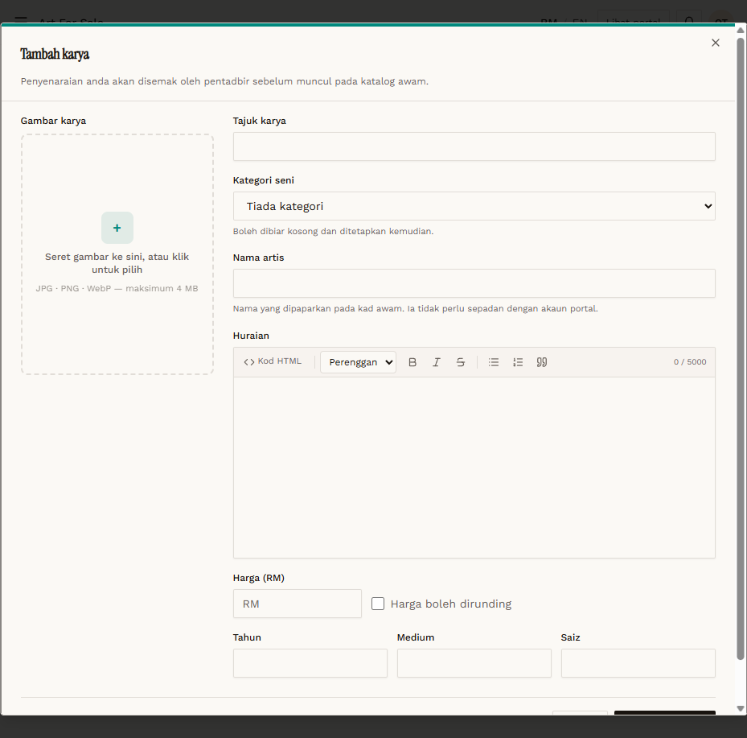

# AFS-01 — Create — required title and artist name

- **Module:** Art For Sale (Admin, Artist)
- **Target:** https://martp.nizamjensani.digital/ · dashboard `/dashboard/art-for-sale` · public `/shop/art-for-sale`
- **Date:** 2026-09-25 · **Tool:** playwright-cli (headed)
- **Priority:** P1
- **Status:** **PASS (cosmetic)**

## Preconditions
Artist QA logged in, `/dashboard/art-for-sale` (0 listings).

## Steps
1. Tambah karya.
2. Simpan karya empty.
3. Fill only the title; save.

## Expected result
Blocked each time.

## Actual result
Modal stays open; native tooltip 'Please fill in this field.' on Tajuk karya, then on Nama artis (English on Malay UI). Nama artis is not pre-filled (unlike Koleksi); the hint says it need not match the portal account.

## Evidence

