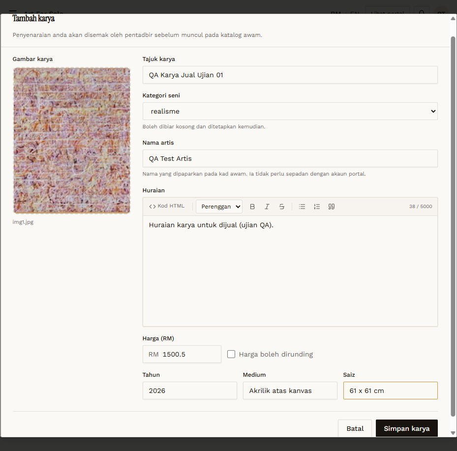
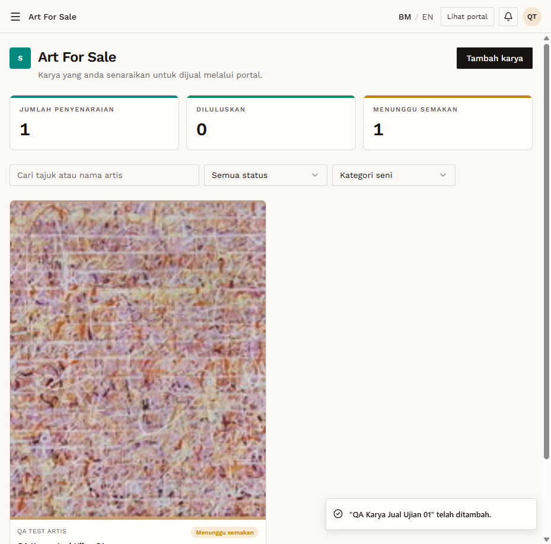
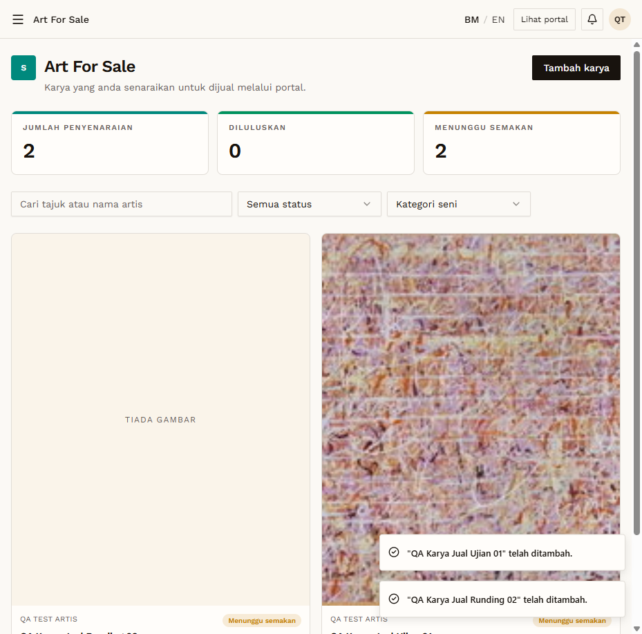

# AFS-04 — Artist creates listings → pending, hidden

- **Module:** Art For Sale (Admin, Artist)
- **Target:** https://martp.nizamjensani.digital/ · dashboard `/dashboard/art-for-sale` · public `/shop/art-for-sale`
- **Date:** 2026-09-25 · **Tool:** playwright-cli (headed)
- **Priority:** P0
- **Status:** **PASS**

## Preconditions
Artist QA logged in. Image `7-_One_step_at_a_time…jpg`.

## Steps
1. Create `QA Karya Jual Ujian 01` (category realisme, RM 1500, year, medium, size, description).
2. Create `QA Karya Jual Runding 02` (no price, 'Harga boleh dirunding' ticked).
3. Search `/shop/art-for-sale?search=QA` as the artist and as an anonymous visitor.

## Expected result
Saved as 'Menunggu semakan'; not public.

## Actual result
Toasts '… telah ditambah.' Counters JUMLAH 2 / MENUNGGU 2. Cards 'QA TEST ARTIS · Menunggu semakan'. Public search: 0 results for both artist and anonymous. The form says the listing is reviewed by admin before it reaches the public catalogue.

## Evidence
  
