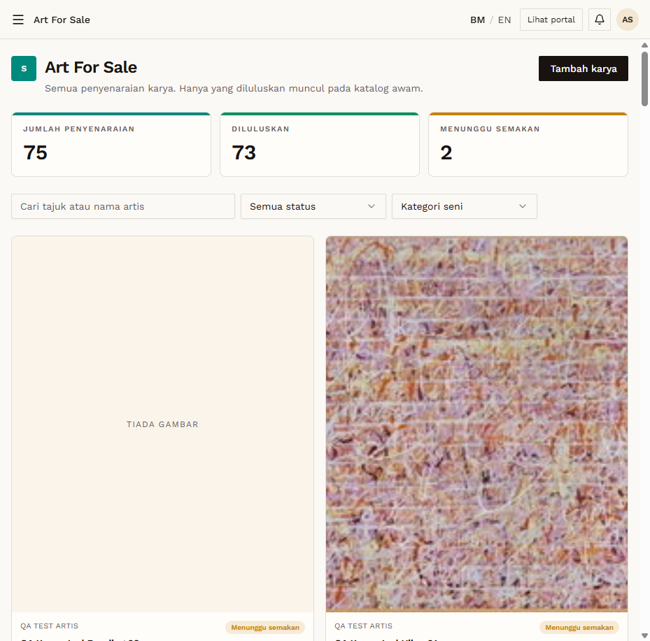
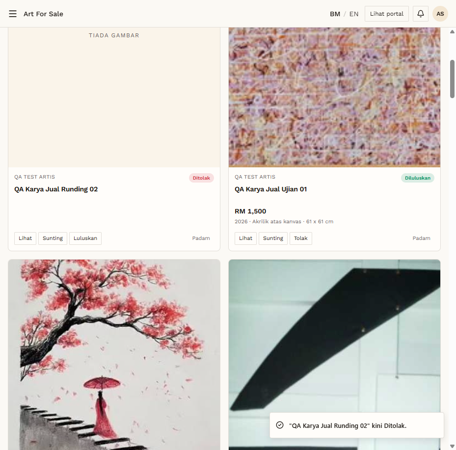
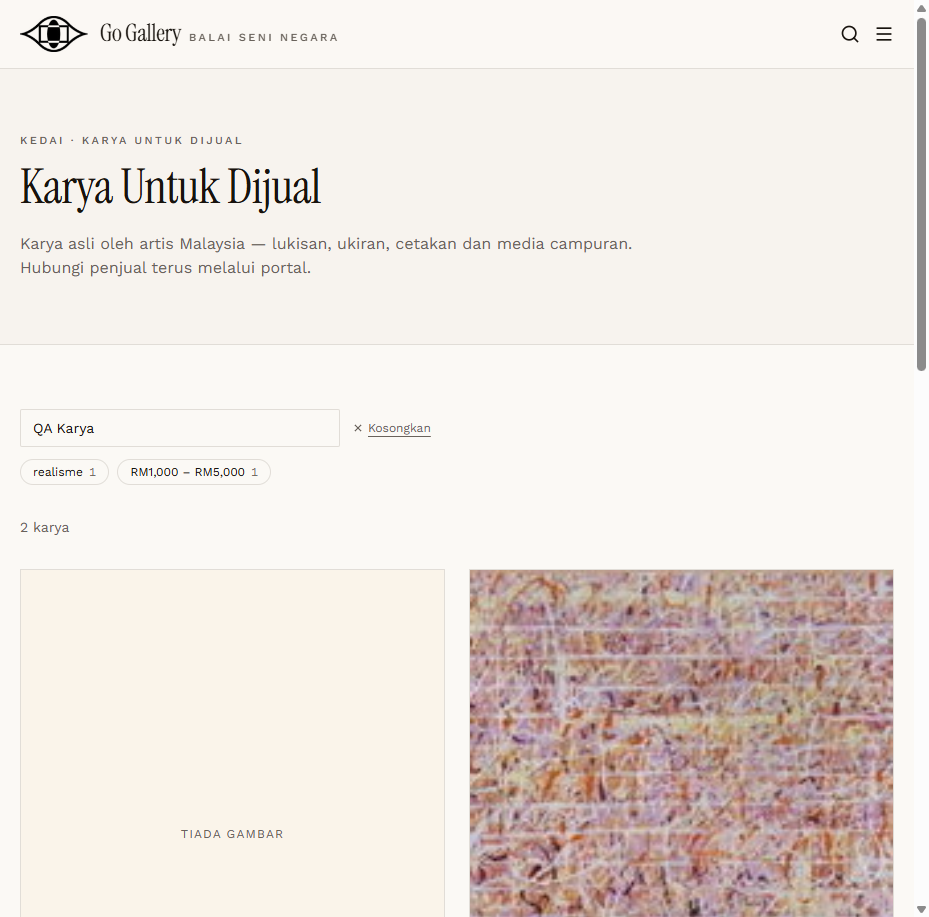

# AFS-05 — Admin approves one listing and rejects the other

- **Module:** Art For Sale (Admin, Artist)
- **Target:** https://martp.nizamjensani.digital/ · dashboard `/dashboard/art-for-sale` · public `/shop/art-for-sale`
- **Date:** 2026-09-25 · **Tool:** playwright-cli (headed)
- **Priority:** P0
- **Status:** **PASS (observation: no reason)**

## Preconditions
Admin logged in (login-page quick-login 'Ahmad Safwan'). Only the two QA items were pending.

## Steps
1. Open `/dashboard/art-for-sale` (73 real listings plus the two).
2. Luluskan `Ujian 01`; Tolak `Runding 02`.
3. Check the public page; later Luluskan `Runding 02`.

## Expected result
Approved becomes public; rejected stays hidden.

## Actual result
Toasts 'kini Diluluskan.' / 'kini Ditolak.' Rejection is instant with no reason or confirmation. Public search showed only the approved item; after re-approval both appear (2 karya).

## Evidence
  
