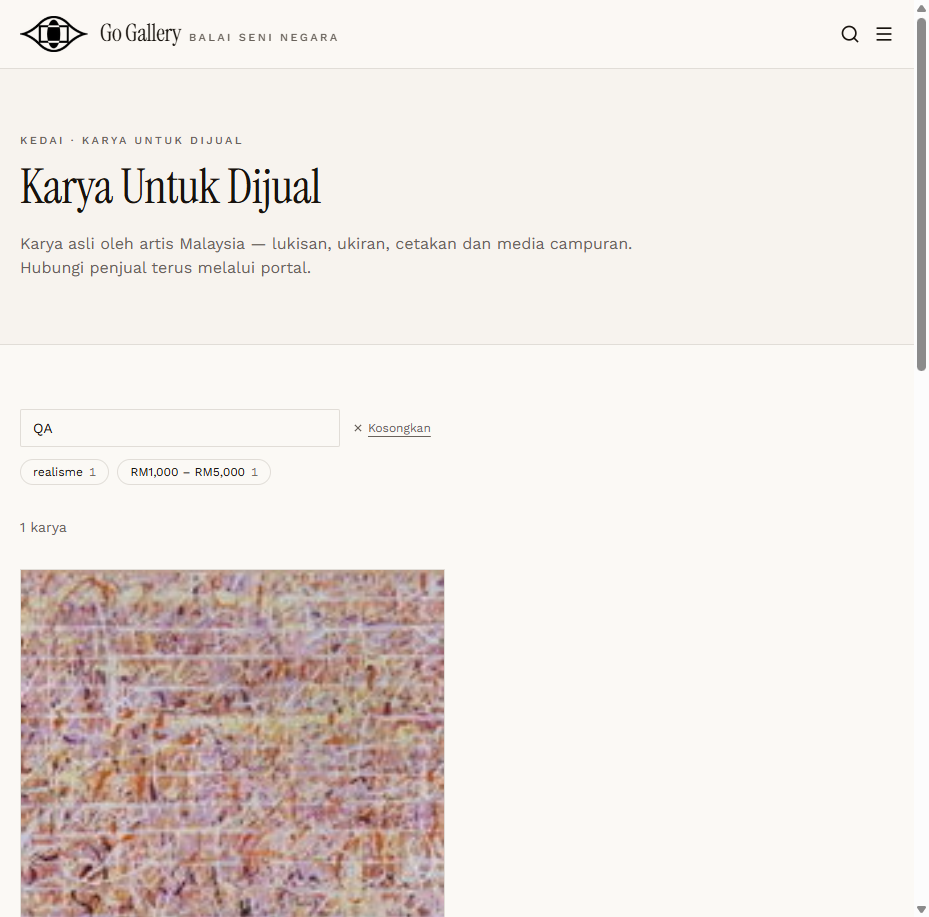
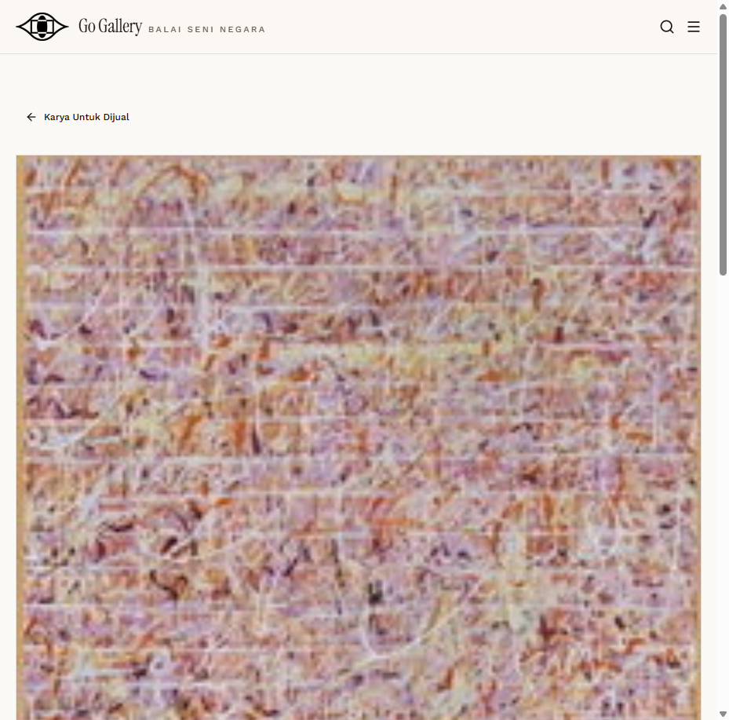

# AFS-06 — Public listing, filters and detail page

- **Module:** Art For Sale (Admin, Artist)
- **Target:** https://martp.nizamjensani.digital/ · dashboard `/dashboard/art-for-sale` · public `/shop/art-for-sale`
- **Date:** 2026-09-25 · **Tool:** playwright-cli (headed)
- **Priority:** P0
- **Status:** **PASS**

## Preconditions
AFS-05 done.

## Steps
1. Open `/shop/art-for-sale?search=QA`.
2. Read filters; open the detail page.

## Expected result
Listing shows image, artist, price and details; filters shown; detail has a contact button.

## Actual result
Listing shows artist, category, description, year, medium, size and price; filter facets by category ('realisme 1') and price range ('RM1,000 – RM5,000'). Detail `/shop/art-for-sale/qa-karya-jual-ujian-01` shows the same data with a 'Hubungi Penjual' button. Image loads.

## Evidence
 
