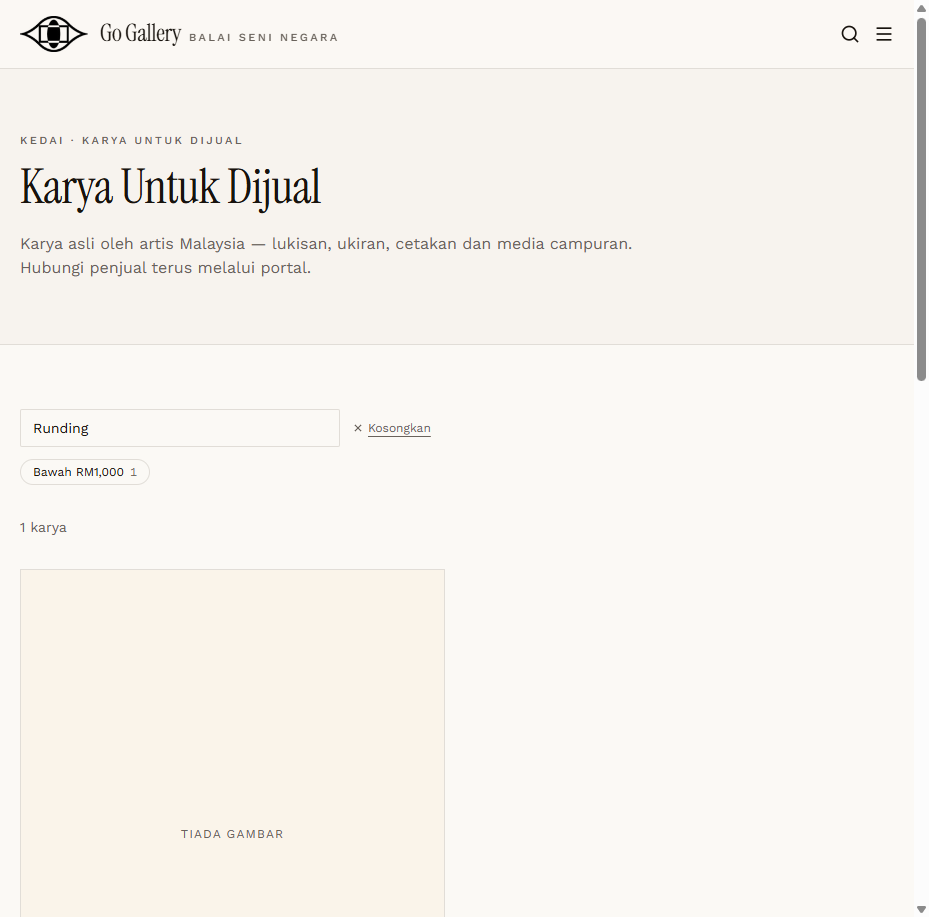
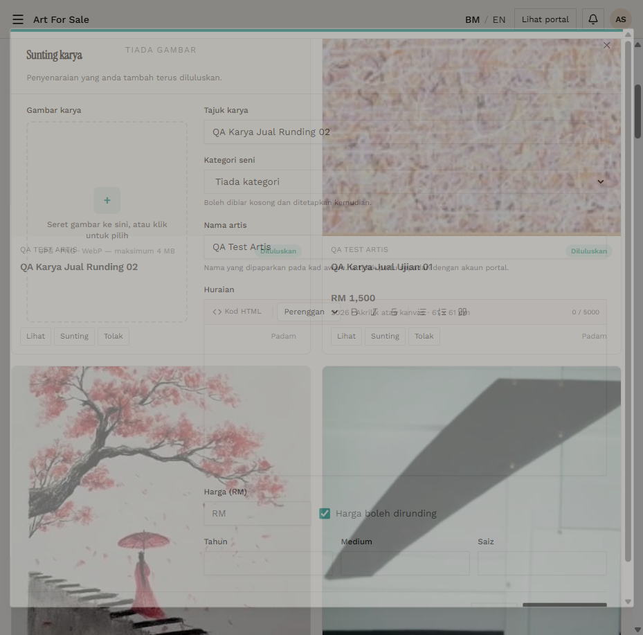

# AFS-07 — Negotiable flag visibility

- **Module:** Art For Sale (Admin, Artist)
- **Target:** https://martp.nizamjensani.digital/ · dashboard `/dashboard/art-for-sale` · public `/shop/art-for-sale`
- **Date:** 2026-09-25 · **Tool:** playwright-cli (headed)
- **Priority:** P2
- **Status:** **PASS (observation: not shown publicly)**

## Preconditions
`Runding 02` edited to RM 800 with 'Harga boleh dirunding' ticked.

## Steps
1. Check the dashboard card.
2. Check the public listing and detail.

## Expected result
The negotiable status is shown to buyers.

## Actual result
Flag saved (also without a price). Dashboard cards show 'RM 800 boleh runding' (an existing real listing shows 'RM 50 boleh runding'). The public listing and detail show only 'RM 800' — the negotiable indication is not visible to buyers.

## Evidence
 
