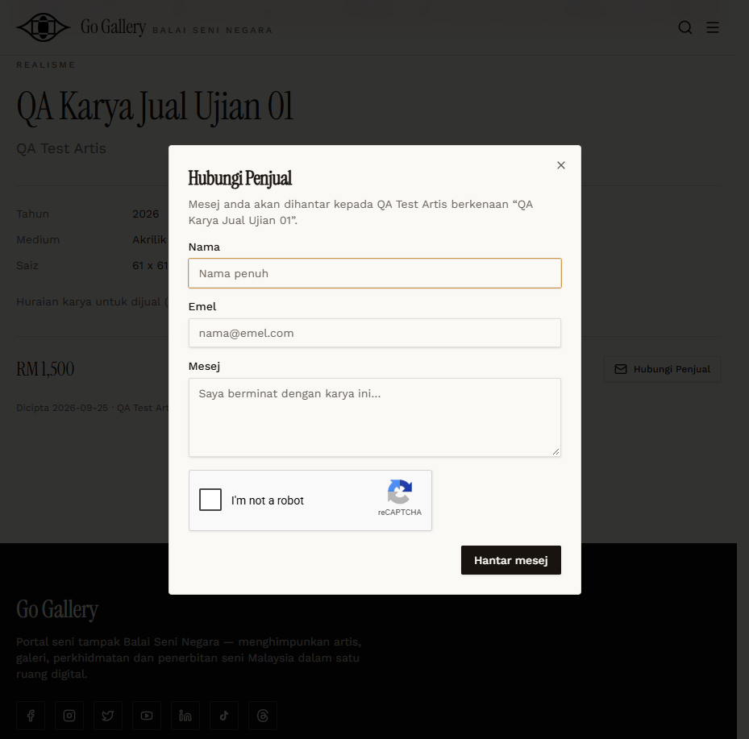
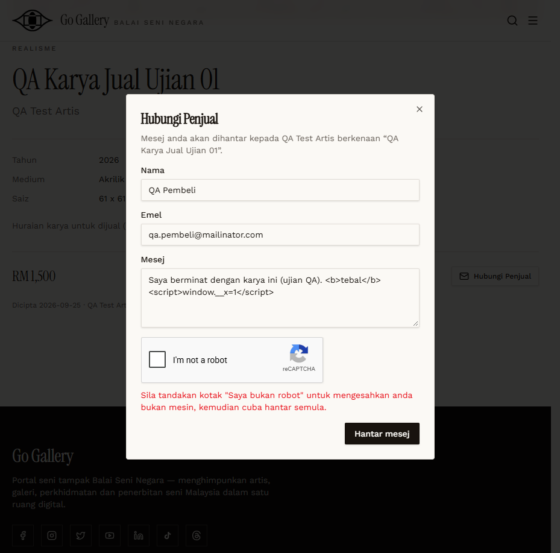

# AFS-08 — Hubungi Penjual form

- **Module:** Art For Sale (Admin, Artist)
- **Target:** https://martp.nizamjensani.digital/ · dashboard `/dashboard/art-for-sale` · public `/shop/art-for-sale`
- **Date:** 2026-09-25 · **Tool:** playwright-cli (headed)
- **Priority:** P0
- **Status:** **BLOCKED (reCAPTCHA)**

## Preconditions
Detail page of an approved listing; anonymous visitor.

## Steps
1. Click Hubungi Penjual (fields Nama, Emel, Mesej; a hidden honeypot field).
2. Submit empty; invalid email; then a valid message.

## Expected result
Message reaches the seller's Inbox.

## Actual result
Form: Nama (100), Emel (255), Mesej (2000). Empty and invalid-email submissions blocked by native tooltips. A valid submission shows 'Sila tandakan kotak "Saya bukan robot"…' — a reCAPTCHA checkbox must be ticked by a human. I did not bypass it, so sending, the seller's Inbox and the message text handling were **not verified**.

## Evidence
 
