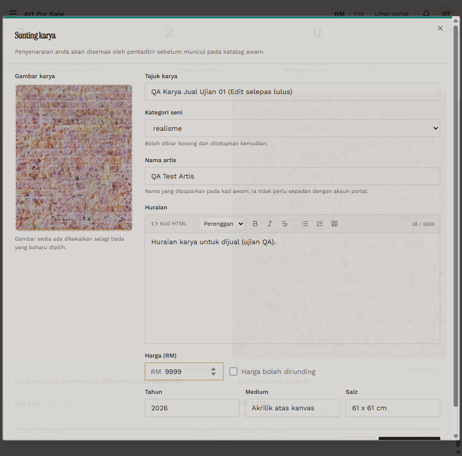

# AFS-10 — Artist edits an approved listing (title and price)

- **Module:** Art For Sale (Admin, Artist)
- **Target:** https://martp.nizamjensani.digital/ · dashboard `/dashboard/art-for-sale` · public `/shop/art-for-sale`
- **Date:** 2026-09-25 · **Tool:** playwright-cli (headed)
- **Priority:** P0
- **Status:** **FAIL (needs product decision)**

## Preconditions
Approved `Ujian 01` (RM 1,500); artist logged in.

## Steps
1. Sunting; change title to '… (Edit selepas lulus)' and price to 9999.
2. Save; check the dashboard and public page.

## Expected result
Returns to review, or the change waits for approval.

## Actual result
The listing stays **Diluluskan**, and the new title and price **RM 9,999** are public immediately. Because price is involved this is more serious than the same defect in other modules. **Needs product decision.**

## Evidence

