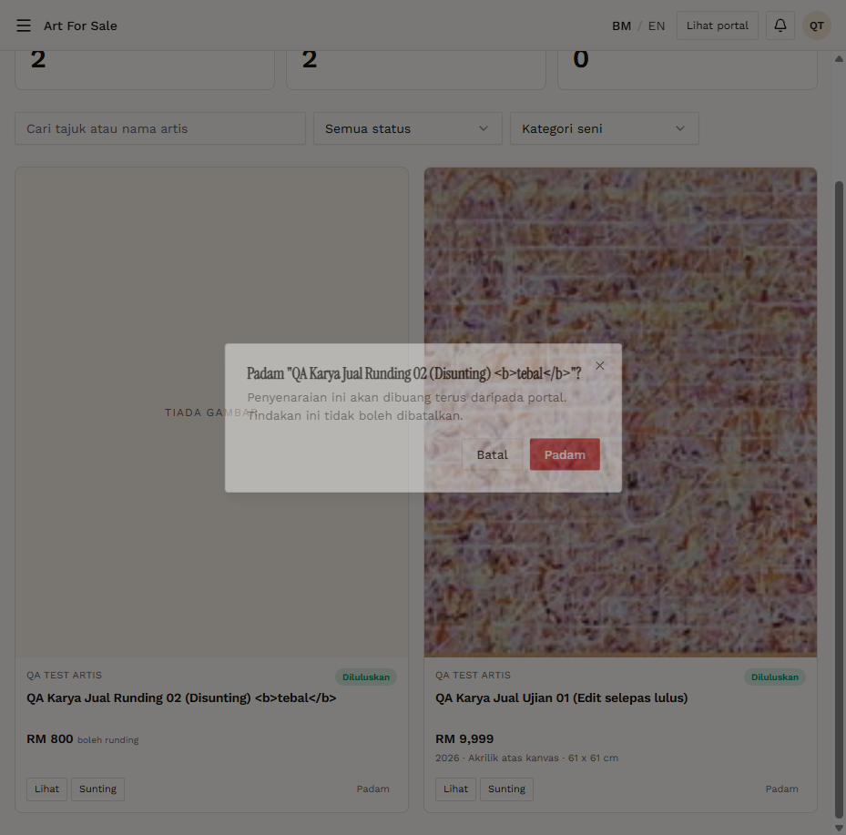

# AFS-11 — Delete listings (Artist) with Batal

- **Module:** Art For Sale (Admin, Artist)
- **Target:** https://martp.nizamjensani.digital/ · dashboard `/dashboard/art-for-sale` · public `/shop/art-for-sale`
- **Date:** 2026-09-25 · **Tool:** playwright-cli (headed)
- **Priority:** P0
- **Status:** **PASS**

## Preconditions
Two approved QA listings.

## Steps
1. Padam → Batal.
2. Padam → Padam on each.
3. Check counter and detail URLs.

## Expected result
Batal keeps; confirm removes; detail 404.

## Actual result
Dialog: 'Padam "…"? Penyenaraian ini akan dibuang terus daripada portal. Tindakan ini tidak boleh dibatalkan.' Batal keeps the item (2). After confirming both the counter is 0 and both detail URLs return 404.

## Evidence

