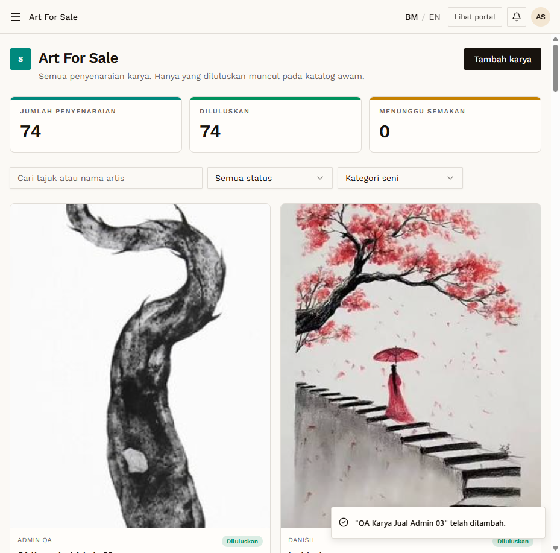

# AFS-12 — Admin creates a listing directly

- **Module:** Art For Sale (Admin, Artist)
- **Target:** https://martp.nizamjensani.digital/ · dashboard `/dashboard/art-for-sale` · public `/shop/art-for-sale`
- **Date:** 2026-09-25 · **Tool:** playwright-cli (headed)
- **Priority:** P1
- **Status:** **PASS**

## Preconditions
Admin logged in.

## Steps
1. Tambah karya (hint: 'terus diluluskan'); image, title `QA Karya Jual Admin 03`, artist `Admin QA`, RM 300.
2. Check the public page; delete it.

## Expected result
Auto-approved and public.

## Actual result
Saved as Diluluskan; public search shows it ('Dicipta oleh Ahmad Safwan'). Deleted afterwards; counters back to 73 / 73 / 0.

## Evidence

