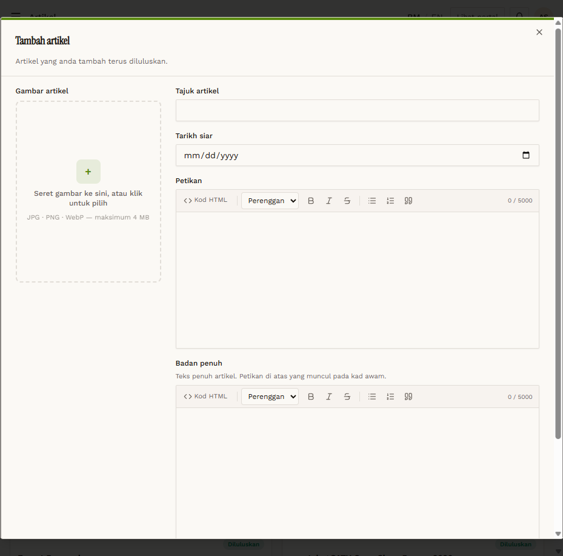

# ART-01 — Create — required title

- **Module:** Artikel (Admin)
- **Target:** https://martp.nizamjensani.digital/ · admin `/dashboard/articles` · public `/resources/articles`
- **Date:** 2026-09-25 · **Tool:** playwright-cli (headed) · **Role:** Admin (login-page quick-login, "Ahmad Safwan")
- **Priority:** P1
- **Status:** **PASS (cosmetic)**

## Preconditions
Admin logged in, `/dashboard/articles`.

## Steps
1. Tambah artikel.
2. Simpan artikel with Tajuk artikel empty.

## Expected result
Blocked.

## Actual result
Modal stays open; native tooltip 'Please fill in this field.' (English on Malay UI).

## Evidence

