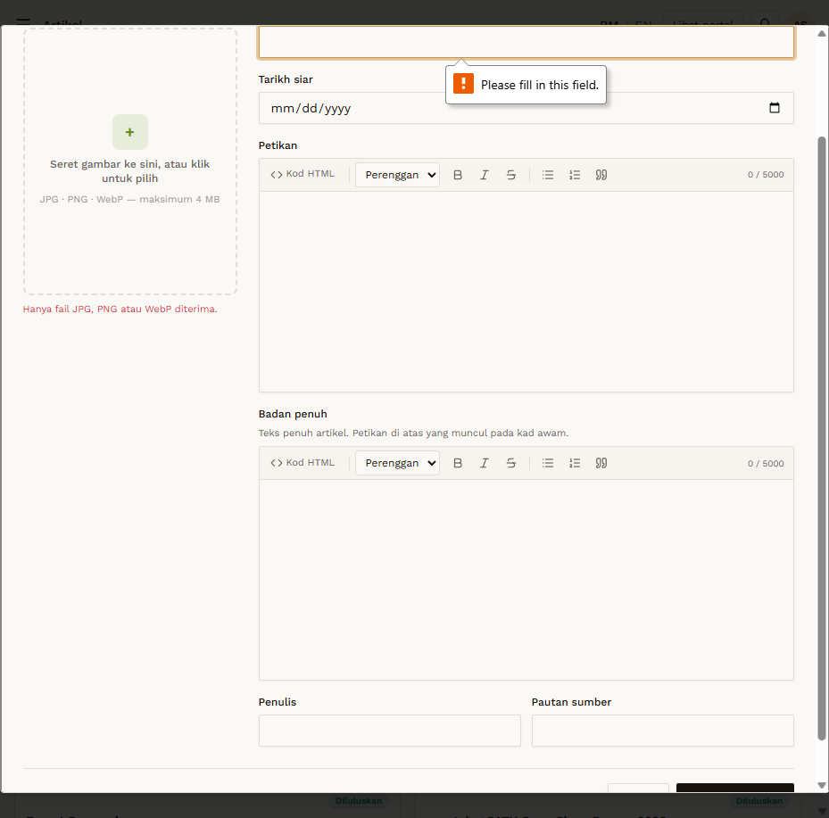

# ART-02 — Image upload — wrong file type

- **Module:** Artikel (Admin)
- **Target:** https://martp.nizamjensani.digital/ · admin `/dashboard/articles` · public `/resources/articles`
- **Date:** 2026-09-25 · **Tool:** playwright-cli (headed) · **Role:** Admin (login-page quick-login, "Ahmad Safwan")
- **Priority:** P1
- **Status:** **PASS**

## Preconditions
Create form open. File `fake.txt` (text).

## Steps
1. Choose `fake.txt` in Gambar artikel.

## Expected result
File rejected with a message.

## Actual result
Input accepts only `image/jpeg,image/png,image/webp`; inline message 'Hanya fail JPG, PNG atau WebP diterima.' No preview shown.

## Evidence

