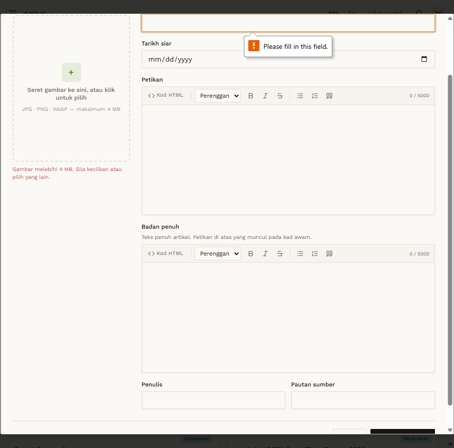

# ART-03 — Image upload — over 4 MB

- **Module:** Artikel (Admin)
- **Target:** https://martp.nizamjensani.digital/ · admin `/dashboard/articles` · public `/resources/articles`
- **Date:** 2026-09-25 · **Tool:** playwright-cli (headed) · **Role:** Admin (login-page quick-login, "Ahmad Safwan")
- **Priority:** P1
- **Status:** **PASS**

## Preconditions
Create form open. `still_life_itik.jpg` (4.7 MB, from project `images/`).

## Steps
1. Choose the 4.7 MB image.

## Expected result
Rejected (limit 4 MB).

## Actual result
Inline message 'Gambar melebihi 4 MB. Sila kecilkan atau pilih yang lain.' No preview. Validation is client-side; server-side enforcement was not checked.

## Evidence

