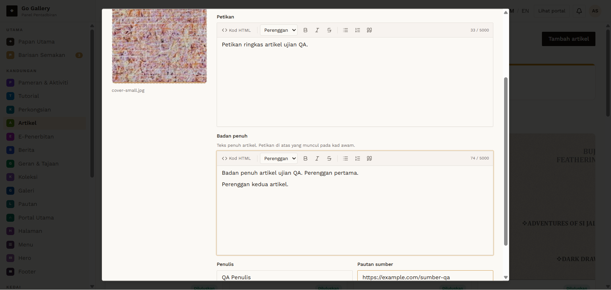
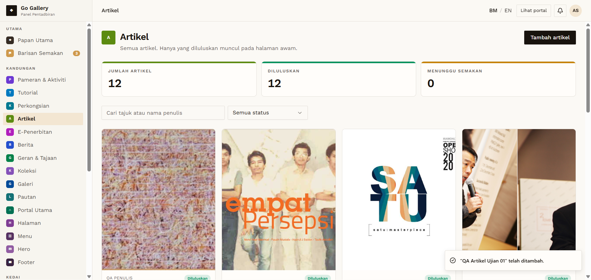

# ART-04 — Create article with cover image → auto-approved

- **Module:** Artikel (Admin)
- **Target:** https://martp.nizamjensani.digital/ · admin `/dashboard/articles` · public `/resources/articles`
- **Date:** 2026-09-25 · **Tool:** playwright-cli (headed) · **Role:** Admin (login-page quick-login, "Ahmad Safwan")
- **Priority:** P0
- **Status:** **PASS**

## Preconditions
Admin logged in. Image `7-_One_step_at_a_time…jpg` (24 KB, from `images/`).

## Steps
1. Tambah artikel; upload the small JPG (preview appears).
2. Tajuk `QA Artikel Ujian 01`, Tarikh siar 2026-09-25, Petikan, Badan penuh (2 paragraphs), Penulis `QA Penulis`, Pautan sumber.
3. Simpan artikel.

## Expected result
Saved and approved directly (form says admin items are approved).

## Actual result
Saved as **Diluluskan**; counter 11→12; card shows 'QA PENULIS', date, '1 minit bacaan' (reading time computed).

## Evidence
 
