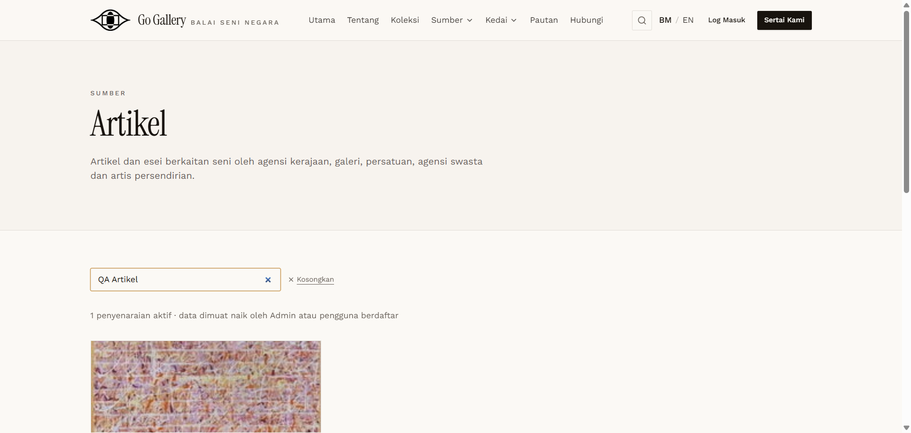
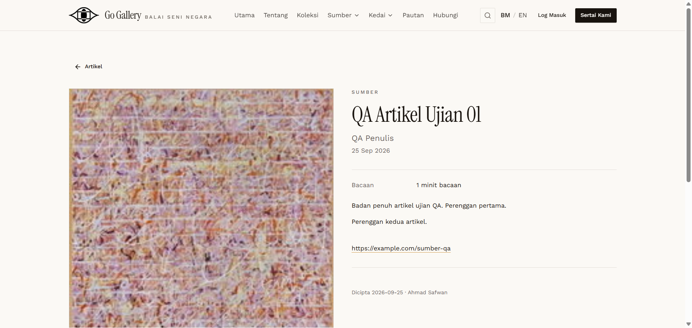

# ART-05 — Public listing, search, detail with image

- **Module:** Artikel (Admin)
- **Target:** https://martp.nizamjensani.digital/ · admin `/dashboard/articles` · public `/resources/articles`
- **Date:** 2026-09-25 · **Tool:** playwright-cli (headed) · **Role:** Admin (login-page quick-login, "Ahmad Safwan")
- **Priority:** P0
- **Status:** **PASS**

## Preconditions
ART-04 done.

## Steps
1. Open `/resources/articles`, search `QA Artikel`.
2. Open the article.

## Expected result
Listed with image and excerpt; detail shows full body.

## Actual result
Listing shows cover image, title, author, date, excerpt (Petikan), 'Dicipta oleh Ahmad Safwan'. Detail `/resources/articles/qa-artikel-ujian-01` shows title, author, date, reading time, both paragraphs and the source link. Image loads (200 px wide).

## Evidence
 
