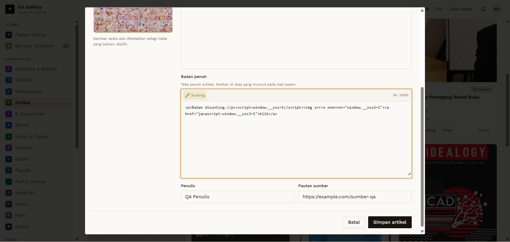

# ART-06 — Edit article

- **Module:** Artikel (Admin)
- **Target:** https://martp.nizamjensani.digital/ · admin `/dashboard/articles` · public `/resources/articles`
- **Date:** 2026-09-25 · **Tool:** playwright-cli (headed) · **Role:** Admin (login-page quick-login, "Ahmad Safwan")
- **Priority:** P0
- **Status:** **PASS**

## Preconditions
ART-04 item exists.

## Steps
1. Sunting; check pre-filled values.
2. Change title and body via Kod HTML; save.

## Expected result
Pre-filled; changes saved.

## Actual result
Title, author and image pre-filled. Saved; list shows the new title.

## Evidence

