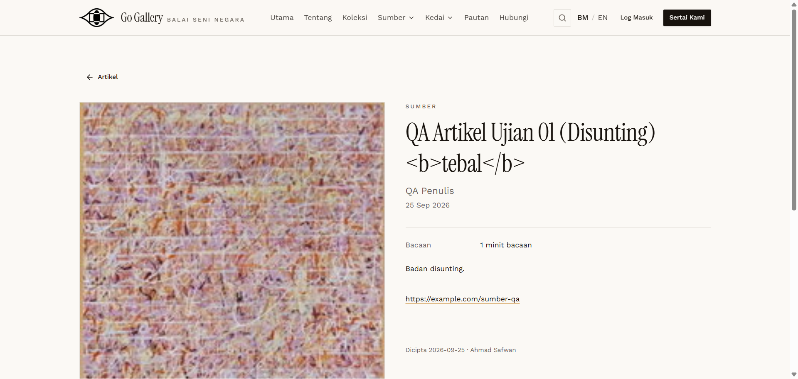

# ART-07 — HTML / script injection in title and body

- **Module:** Artikel (Admin)
- **Target:** https://martp.nizamjensani.digital/ · admin `/dashboard/articles` · public `/resources/articles`
- **Date:** 2026-09-25 · **Tool:** playwright-cli (headed) · **Role:** Admin (login-page quick-login, "Ahmad Safwan")
- **Priority:** P0
- **Status:** **PASS**

## Preconditions
Edit form open.

## Steps
1. Title `… <b>tebal</b>`.
2. Body (Kod HTML) contains `<script>`, `` and `<a href="javascript:…">`.
3. Save; open the public detail page.

## Expected result
Markup neutralised; no script execution.

## Actual result
Title shown literally as text `<b>tebal</b>` (escaped, no bold). On the public page no `<script>`, `onerror` or `javascript:` link exists; `window.__xss*` are undefined; no JS dialog fired. Dangerous elements were stripped.

## Evidence

