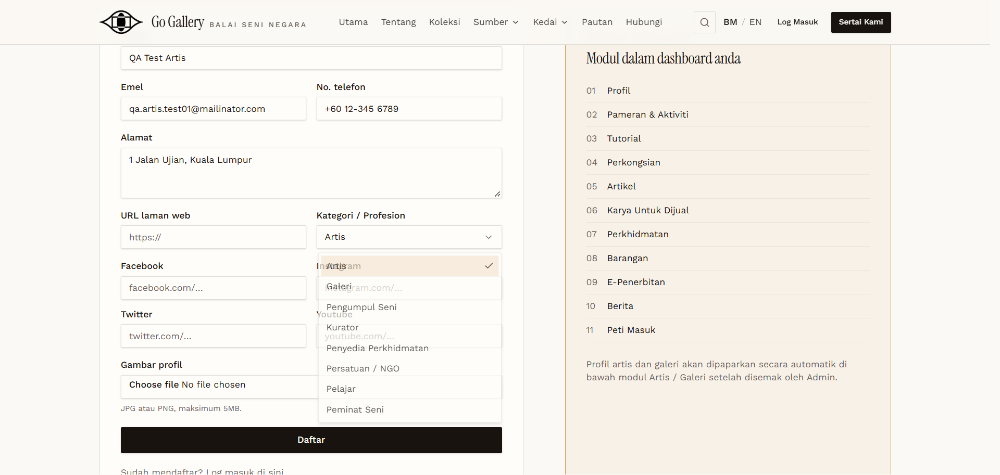

# AUTH-01 — Register as Artis (valid data)

- **Module:** Pengurusan Pengguna (Authentication / Registration)
- **Target:** https://martp.nizamjensani.digital/
- **Date:** 2026-09-25
- **Tool:** playwright-cli (headed)
- **Priority:** P0
- **Status:** **PASS**

## Preconditions
Logged out. Email not previously registered.

## Steps
1. Open `/register`.
2. Fill Nama `QA Test Artis`, Emel `qa.artis.test01@mailinator.com`, No. telefon `+60 12-345 6789`, Alamat `1 Jalan Ujian, Kuala Lumpur`.
3. Select Kategori = Artis.
4. Click Daftar.

## Expected result
Registration accepted and user is asked to complete the account.

## Actual result
Redirected to `/password/renew` (the form has no password field, so it is set afterwards). Message: registration received, profile will be reviewed by admin.

## Evidence

