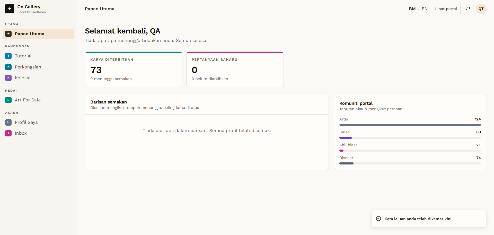

# AUTH-04 — Set password — valid

- **Module:** Pengurusan Pengguna (Authentication / Registration)
- **Target:** https://martp.nizamjensani.digital/
- **Date:** 2026-09-25
- **Tool:** playwright-cli (headed)
- **Priority:** P0
- **Status:** **PASS (with observation)**

## Preconditions
On `/password/renew`.

## Steps
1. Enter `Test@12345` in both fields.
2. Click Simpan dan teruskan.

## Expected result
Account completed and user lands on dashboard.

## Actual result
Redirected to `/dashboard` with 'Kata laluan anda telah dikemas kini'. Observation: dashboard titled 'Panel Pentadbiran' shows site-wide stats (73 published artworks; accounts by role Artis 724, Galeri 64, Ahli biasa 21, Disekat 74) to a new non-admin user — confirm intended.

## Evidence

