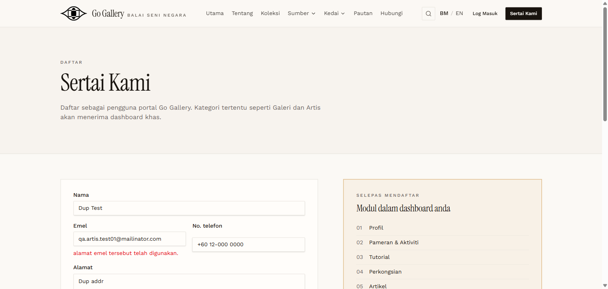

# AUTH-11 — Register with existing email

- **Module:** Pengurusan Pengguna (Authentication / Registration)
- **Target:** https://martp.nizamjensani.digital/
- **Date:** 2026-09-25
- **Tool:** playwright-cli (headed)
- **Priority:** P1
- **Status:** **PASS (cosmetic issue)**

## Preconditions
Artis email already registered.

## Steps
1. Open `/register`.
2. Fill all required fields using `qa.artis.test01@mailinator.com`, Kategori Artis.
3. Submit.

## Expected result
Rejected with an error.

## Actual result
Error 'alamat emel tersebut telah digunakan.' under Emel. Cosmetic: message is lowercase and the phone field is misaligned.

## Evidence

