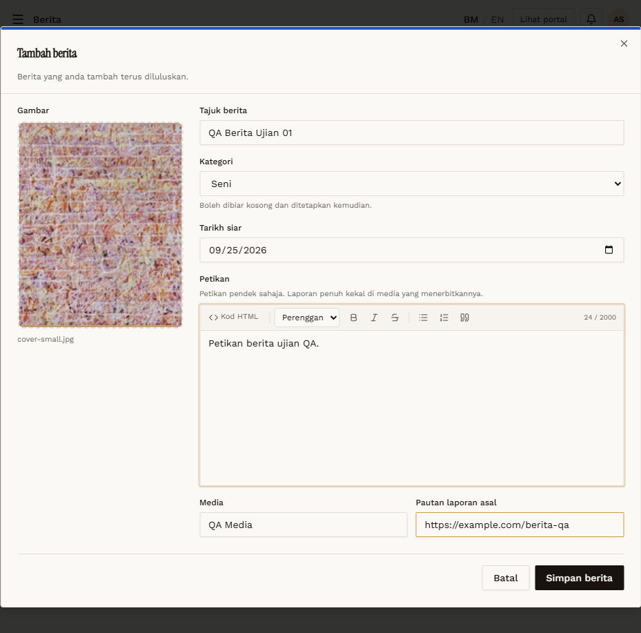
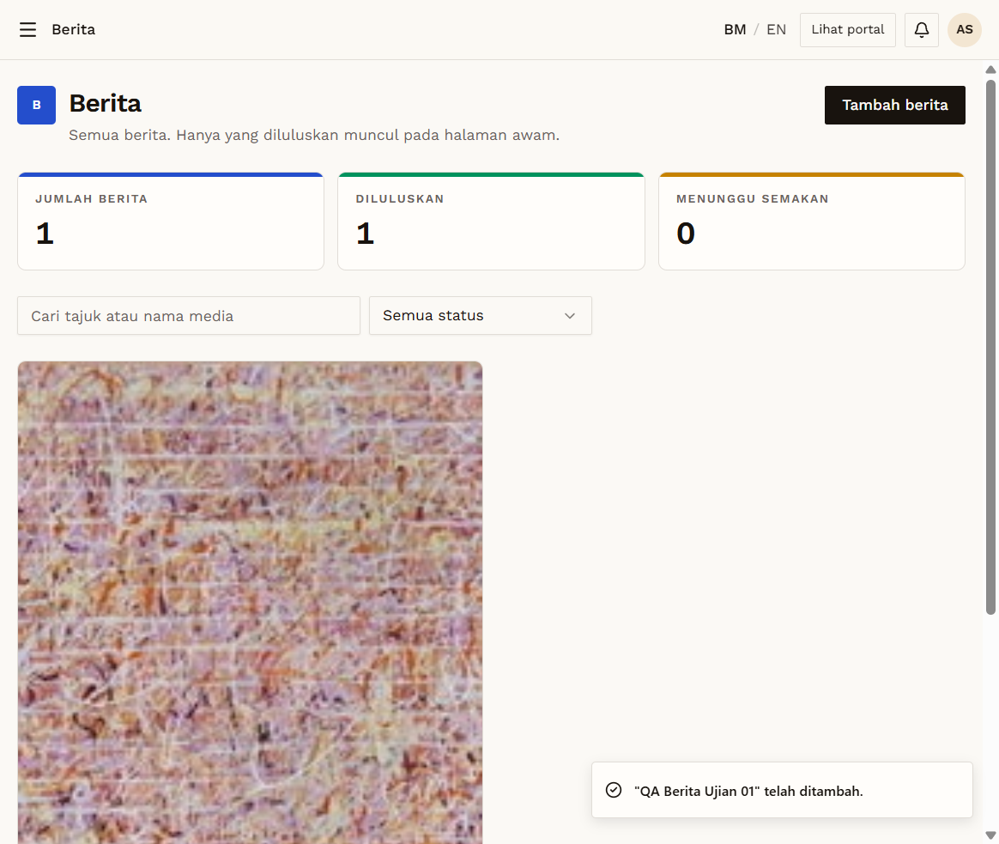

# BRT-03 — Create berita → auto-approved

- **Module:** Berita (Admin)
- **Target:** https://martp.nizamjensani.digital/ · admin `/dashboard/news` · public `/resources/news`
- **Date:** 2026-09-25 · **Tool:** playwright-cli (headed) · **Role:** Admin (login-page quick-login, "Ahmad Safwan")
- **Priority:** P0
- **Status:** **PASS**

## Preconditions
Admin logged in. Image `7-_One_step_at_a_time…jpg` (24 KB).

## Steps
1. Fill Tajuk `QA Berita Ujian 01`, Kategori = Seni (options: Tiada kategori, Seni), Tarikh siar, Petikan, Media `QA Media`, Pautan laporan asal `https://example.com/berita-qa`.
2. Attach image; Simpan berita.

## Expected result
Saved and approved directly.

## Actual result
Toast '… telah ditambah.'; counters 0→1; card 'QA MEDIA · Diluluskan · 25 Sep 2026' with the original-report link.

## Evidence
 
