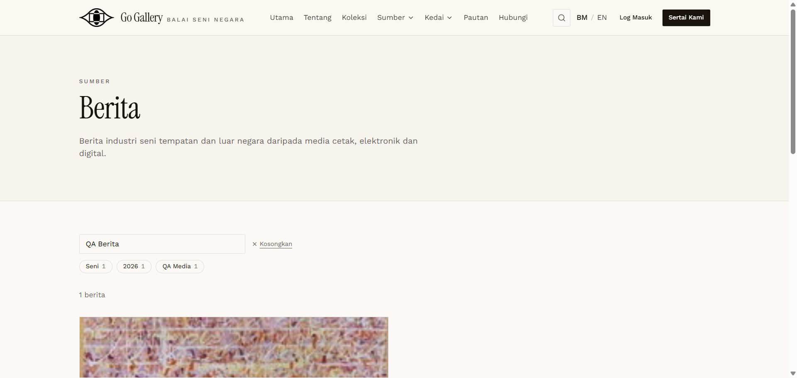
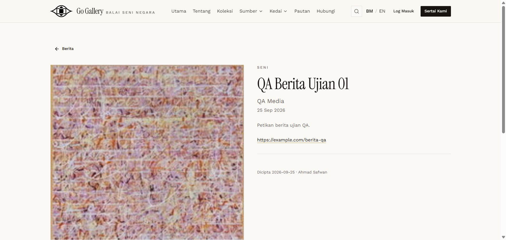

# BRT-04 — Public listing, facets and detail

- **Module:** Berita (Admin)
- **Target:** https://martp.nizamjensani.digital/ · admin `/dashboard/news` · public `/resources/news`
- **Date:** 2026-09-25 · **Tool:** playwright-cli (headed) · **Role:** Admin (login-page quick-login, "Ahmad Safwan")
- **Priority:** P0
- **Status:** **PASS**

## Preconditions
BRT-03 done.

## Steps
1. Search `QA Berita` on `/resources/news`.
2. Use the Seni category filter and a wrong year (2019).
3. Open the item.

## Expected result
Listed with image, excerpt, category and media; filters work; detail shows the link.

## Actual result
Listing shows image, 'QA MEDIA · SENI', excerpt, 'Dicipta oleh Ahmad Safwan'. Facets 'Seni 1', '2026 1', 'QA Media 1' appear; Seni filter gives 1 berita (`?category=seni`); year 2019 gives 0. Detail `/resources/news/qa-berita-ujian-01` shows the excerpt and the original-report link (opens in a new tab with `rel=noreferrer`).

## Evidence
 
