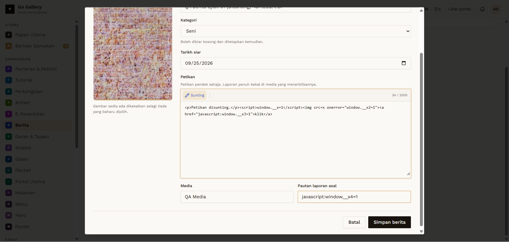

# BRT-05 — Edit berita

- **Module:** Berita (Admin)
- **Target:** https://martp.nizamjensani.digital/ · admin `/dashboard/news` · public `/resources/news`
- **Date:** 2026-09-25 · **Tool:** playwright-cli (headed) · **Role:** Admin (login-page quick-login, "Ahmad Safwan")
- **Priority:** P0
- **Status:** **PASS**

## Preconditions
BRT-03 item exists.

## Steps
1. Sunting; check pre-filled values.
2. Change title and Petikan; save.

## Expected result
Pre-filled; saved.

## Actual result
Title, category, media, link, date and image preview pre-filled. Saved; toast 'telah dikemas kini'; list and public page updated. Slug stays `qa-berita-ujian-01`.

## Evidence

