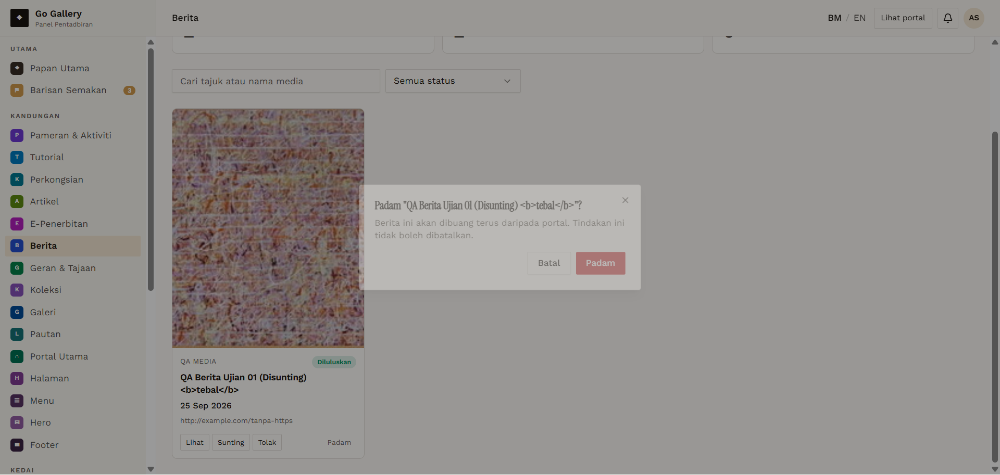

# BRT-09 — Delete with confirmation and Batal

- **Module:** Berita (Admin)
- **Target:** https://martp.nizamjensani.digital/ · admin `/dashboard/news` · public `/resources/news`
- **Date:** 2026-09-25 · **Tool:** playwright-cli (headed) · **Role:** Admin (login-page quick-login, "Ahmad Safwan")
- **Priority:** P0
- **Status:** **PASS**

## Preconditions
Approved item.

## Steps
1. Padam → Batal.
2. Padam → Padam.
3. Check count, public search and detail URL.

## Expected result
Batal keeps; confirm removes everywhere.

## Actual result
Dialog: 'Padam "…"? Berita ini akan dibuang terus… tidak boleh dibatalkan.' Batal keeps the item. After confirming: count 0, public search 0 berita, detail 404.

## Evidence

