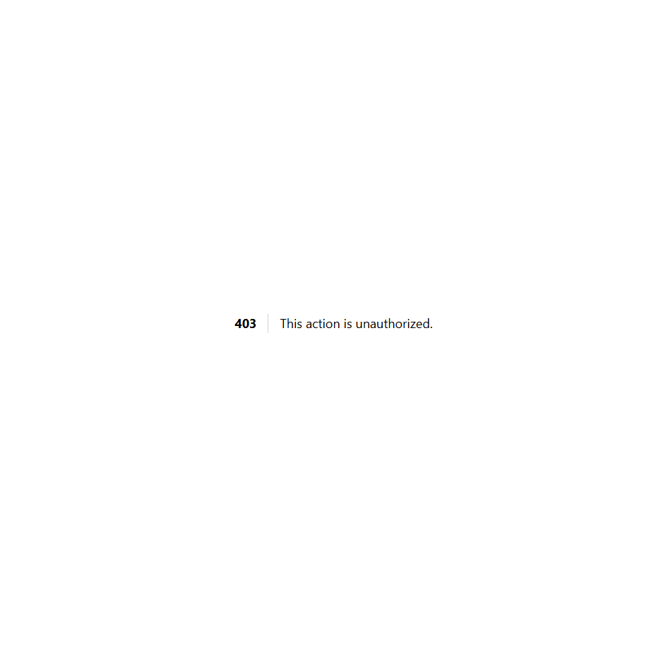

# MER-10 — Non-admin and anonymous access

- **Module:** Cenderahati (Merchandises) (Admin only)
- **Target:** https://martp.nizamjensani.digital/ · dashboard `/dashboard/merchandises` · public `/shop/merchandises`
- **Date:** 2026-09-25 · **Tool:** playwright-cli (headed) · **Role:** Admin (login-page quick-login, "Ahmad Safwan")
- **Priority:** P0
- **Status:** **PASS (observation: mixed naming)**

## Preconditions
Artist QA, Galeri QA, anonymous.

## Steps
1. Check each sidebar; open `/dashboard/merchandises`.
2. Anonymous opens it.

## Expected result
Denied; anonymous sent to login.

## Actual result
No Cenderahati entry in either sidebar; both get 403; anonymous redirected to `/login`. (The sidebar calls the module 'Cenderahati'; the page title reads 'Merchandises'.)

## Evidence

