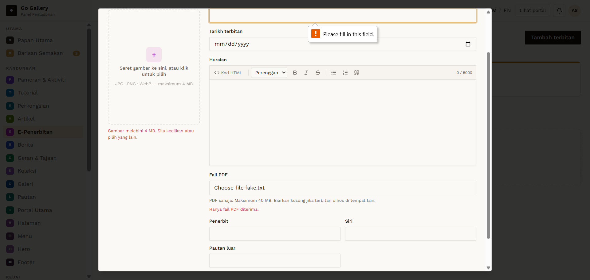
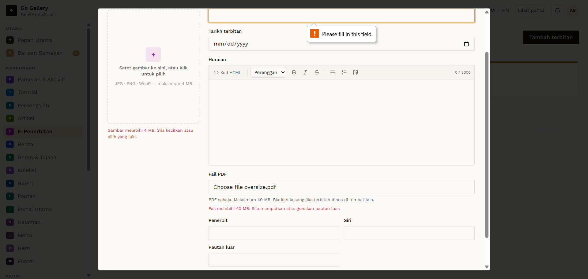

# EPB-03 — PDF — wrong type and over 40 MB

- **Module:** E-Penerbitan (Admin)
- **Target:** https://martp.nizamjensani.digital/ · admin `/dashboard/epublications` · public `/resources/e-publications`
- **Date:** 2026-09-25 · **Tool:** playwright-cli (headed) · **Role:** Admin (login-page quick-login, "Ahmad Safwan")
- **Priority:** P0
- **Status:** **PASS**

## Preconditions
Create form open. `fake.txt`, a 41 MB PDF-headed file.

## Steps
1. Choose `fake.txt` in Fail PDF.
2. Choose the 41 MB file.

## Expected result
Both rejected.

## Actual result
'Hanya fail PDF diterima.' and 'Fail melebihi 40 MB. Sila mampatkan atau gunakan pautan luar.' shown inline.

## Evidence
 
