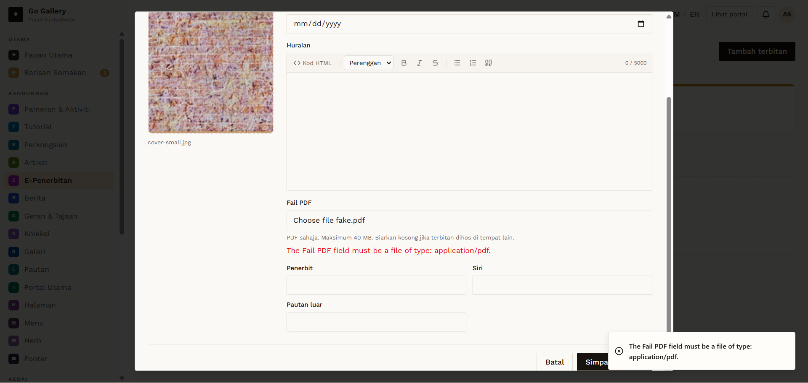

# EPB-04 — Text file renamed .pdf

- **Module:** E-Penerbitan (Admin)
- **Target:** https://martp.nizamjensani.digital/ · admin `/dashboard/epublications` · public `/resources/e-publications`
- **Date:** 2026-09-25 · **Tool:** playwright-cli (headed) · **Role:** Admin (login-page quick-login, "Ahmad Safwan")
- **Priority:** P1
- **Status:** **PASS (cosmetic)**

## Preconditions
Create form open. `fake.pdf` containing plain text.

## Steps
1. Choose `fake.pdf` (accepted by the browser check).
2. Fill the title and Simpan terbitan.

## Expected result
Server rejects the invalid file.

## Actual result
Save refused; toast 'The Fail PDF field must be a file of type: application/pdf.' (server checks content; message is in English). Nothing was created (count stays 0).

## Evidence

