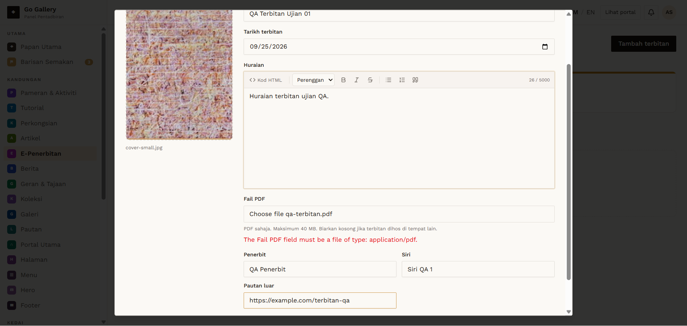
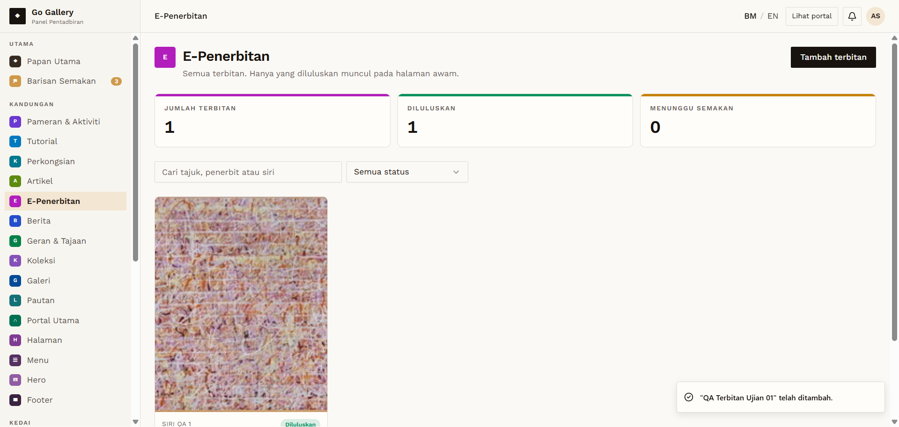

# EPB-05 — Create publication with cover and PDF → auto-approved

- **Module:** E-Penerbitan (Admin)
- **Target:** https://martp.nizamjensani.digital/ · admin `/dashboard/epublications` · public `/resources/e-publications`
- **Date:** 2026-09-25 · **Tool:** playwright-cli (headed) · **Role:** Admin (login-page quick-login, "Ahmad Safwan")
- **Priority:** P0
- **Status:** **PASS**

## Preconditions
Admin logged in. Cover `7-_One_step_at_a_time…jpg`; small valid `qa-terbitan.pdf`.

## Steps
1. Fill Tajuk `QA Terbitan Ujian 01`, Tarikh, Huraian, Penerbit `QA Penerbit`, Siri `Siri QA 1`, Pautan luar.
2. Attach cover and PDF; Simpan terbitan.

## Expected result
Saved and approved directly.

## Actual result
Toast '… telah ditambah.'; counters 0→1; card 'SIRI QA 1 · Diluluskan · Sep 2026 · 1 KB · QA Penerbit'.

## Evidence
 
