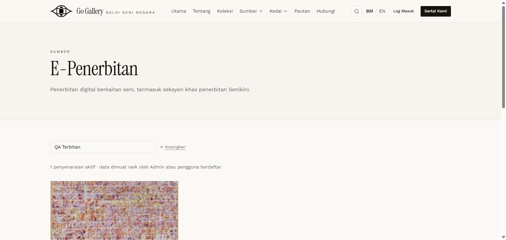
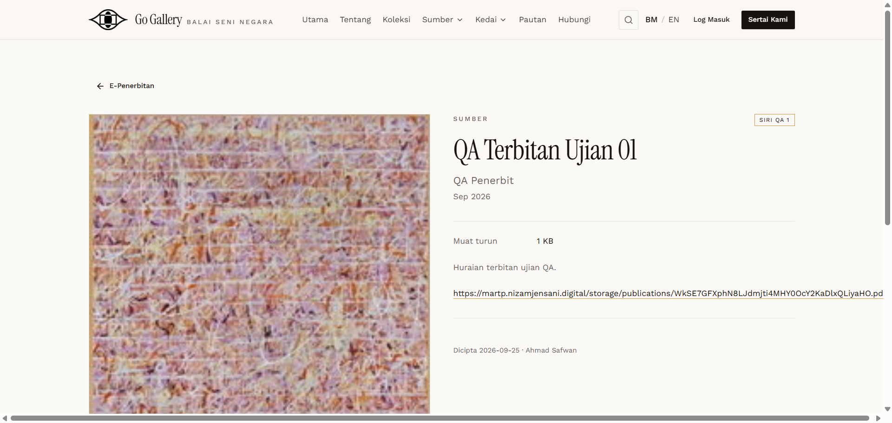

# EPB-06 — Public listing, detail and PDF download

- **Module:** E-Penerbitan (Admin)
- **Target:** https://martp.nizamjensani.digital/ · admin `/dashboard/epublications` · public `/resources/e-publications`
- **Date:** 2026-09-25 · **Tool:** playwright-cli (headed) · **Role:** Admin (login-page quick-login, "Ahmad Safwan")
- **Priority:** P0
- **Status:** **PASS (observation)**

## Preconditions
EPB-05 done.

## Steps
1. Search `QA Terbitan` on `/resources/e-publications`.
2. Open detail.
3. Request the PDF link.

## Expected result
Listed with cover and download link; the PDF is served.

## Actual result
Listing shows cover, series, publisher, 'Muat turun 1 KB'. Detail `/resources/e-publications/qa-terbitan-ujian-01` shows the PDF download link. PDF returns 200 `application/pdf`, 193 bytes (matches the upload). Observation: the external link entered (Pautan luar) is not shown while a PDF is attached (consistent with the form hint).

## Evidence
 
