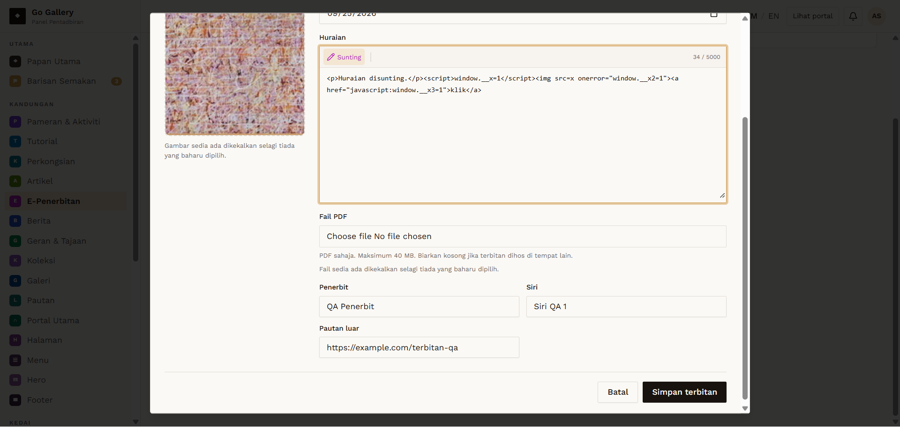

# EPB-07 — Edit publication

- **Module:** E-Penerbitan (Admin)
- **Target:** https://martp.nizamjensani.digital/ · admin `/dashboard/epublications` · public `/resources/e-publications`
- **Date:** 2026-09-25 · **Tool:** playwright-cli (headed) · **Role:** Admin (login-page quick-login, "Ahmad Safwan")
- **Priority:** P0
- **Status:** **PASS**

## Preconditions
EPB-05 item exists.

## Steps
1. Sunting; check pre-filled values.
2. Change title and description; save.

## Expected result
Pre-filled; saved.

## Actual result
Title, publisher, series, external link, date and cover preview pre-filled. Saved; toast 'telah dikemas kini'; list and public page show new values. The slug stays `qa-terbitan-ujian-01` after the title change (URL unchanged).

## Evidence

