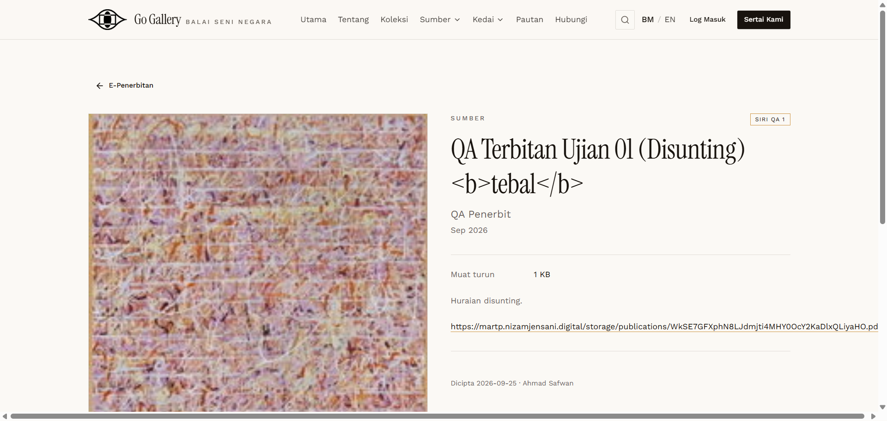

# EPB-08 — HTML / script injection

- **Module:** E-Penerbitan (Admin)
- **Target:** https://martp.nizamjensani.digital/ · admin `/dashboard/epublications` · public `/resources/e-publications`
- **Date:** 2026-09-25 · **Tool:** playwright-cli (headed) · **Role:** Admin (login-page quick-login, "Ahmad Safwan")
- **Priority:** P0
- **Status:** **PASS**

## Preconditions
Edit form open.

## Steps
1. Title `… <b>tebal</b>`.
2. Description (Kod HTML) with `<script>`, ``, `javascript:` link.
3. Save; open the public detail page.

## Expected result
Escaped or stripped; nothing executes.

## Actual result
Title shown as literal text (escaped). Public page has no `<script>`, `onerror` or `javascript:` link; `window.__x*` undefined; no dialog fired.

## Evidence

