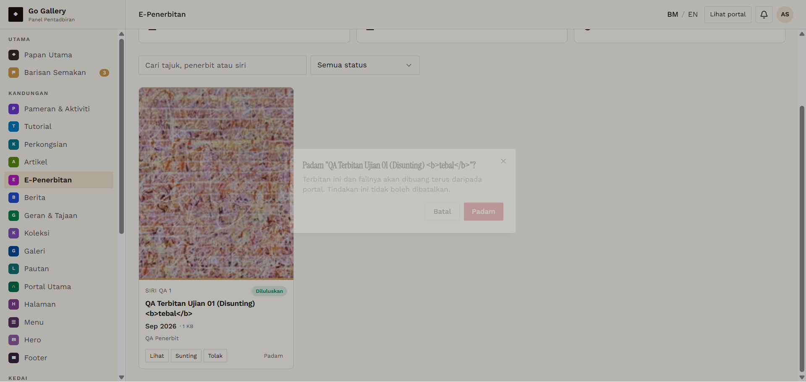

# EPB-10 — Delete removes item and file

- **Module:** E-Penerbitan (Admin)
- **Target:** https://martp.nizamjensani.digital/ · admin `/dashboard/epublications` · public `/resources/e-publications`
- **Date:** 2026-09-25 · **Tool:** playwright-cli (headed) · **Role:** Admin (login-page quick-login, "Ahmad Safwan")
- **Priority:** P0
- **Status:** **PASS (observation: CDN keeps deleted PDF)**

## Preconditions
Approved item with PDF.

## Steps
1. Padam → Batal (item kept).
2. Padam → Padam.
3. Check count, detail URL and the PDF URL.

## Expected result
Item and file removed everywhere.

## Actual result
Dialog: 'Terbitan ini dan failnya akan dibuang terus daripada portal.' Batal keeps the item. After confirming: count 0, detail 404. The PDF URL kept returning 200 (`cf-cache-status: HIT`, `cache-control: public, max-age=2592000`); the same URL with a cache-busting query returned 404. So the file is deleted from the server but the CDN keeps serving the old copy for up to 30 days.

## Evidence

