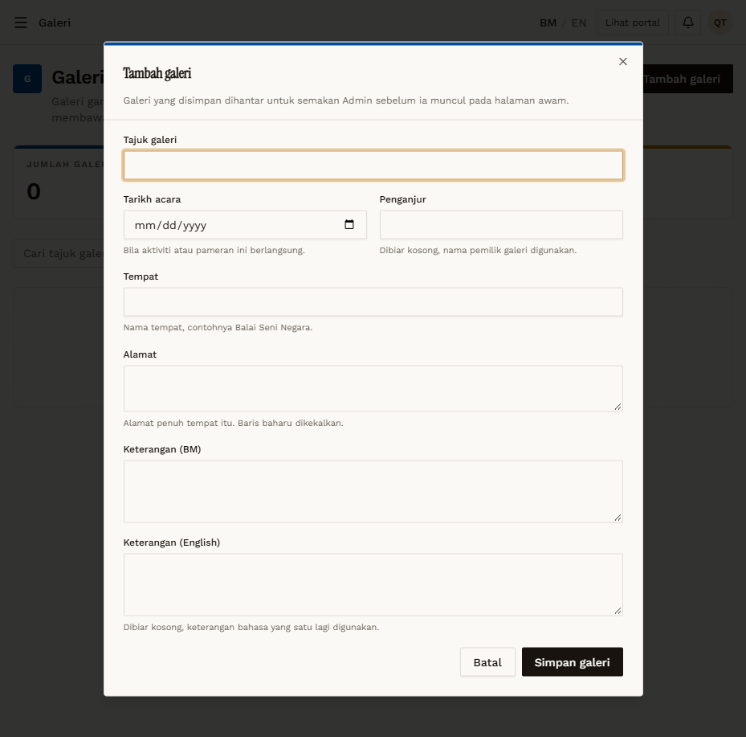

# GAL-01 — Create galeri — required title

- **Module:** Galeri (Galeri user, Admin)
- **Target:** https://martp.nizamjensani.digital/ · dashboard `/dashboard/galleries` · public `/resources/galleries`
- **Date:** 2026-09-25 · **Tool:** playwright-cli (headed)
- **Priority:** P1
- **Status:** **PASS (cosmetic)**

## Preconditions
Galeri QA logged in, `/dashboard/galleries` (0 items).

## Steps
1. Tambah galeri.
2. Simpan galeri with Tajuk galeri empty.

## Expected result
Blocked.

## Actual result
Modal stays open; native tooltip 'Please fill in this field.' (English on Malay UI).

## Evidence

