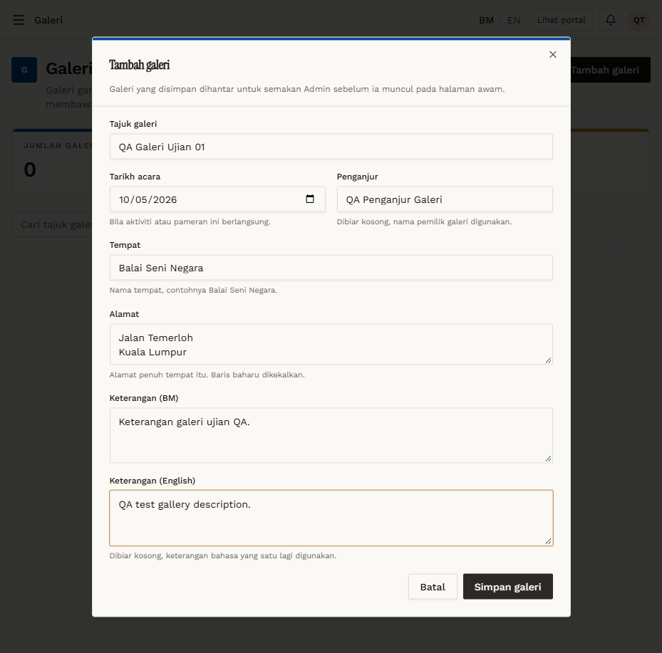
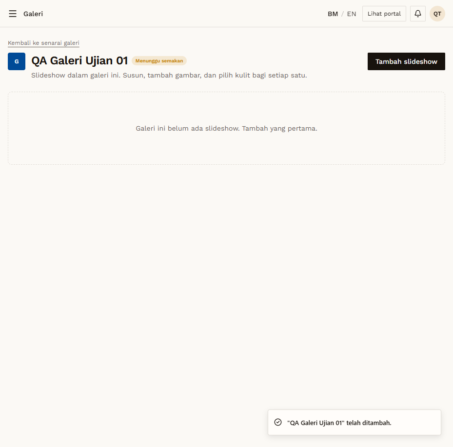

# GAL-02 — Galeri creates a galeri → pending

- **Module:** Galeri (Galeri user, Admin)
- **Target:** https://martp.nizamjensani.digital/ · dashboard `/dashboard/galleries` · public `/resources/galleries`
- **Date:** 2026-09-25 · **Tool:** playwright-cli (headed)
- **Priority:** P0
- **Status:** **PASS**

## Preconditions
Galeri QA logged in.

## Steps
1. Fill Tajuk `QA Galeri Ujian 01`, Tarikh acara 2026-10-05, Penganjur, Tempat, Alamat (2 lines), Keterangan BM and English.
2. Simpan galeri.

## Expected result
Saved as pending (form says it is sent to admin before public) and the user can add slideshows.

## Actual result
Toast '… telah ditambah.'; redirected to `/dashboard/galleries/11/edit` with badge 'Menunggu semakan' and 'Tambah slideshow'. List counters: JUMLAH 1, MENUNGGU 1.

## Evidence
 
