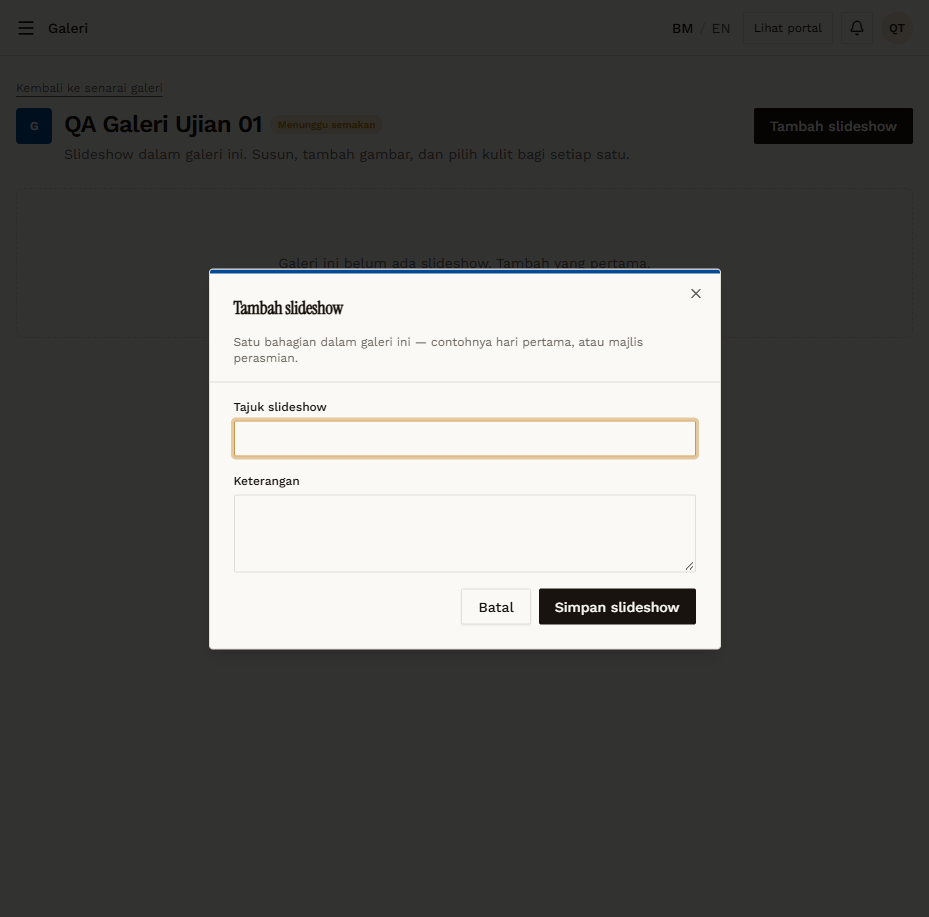
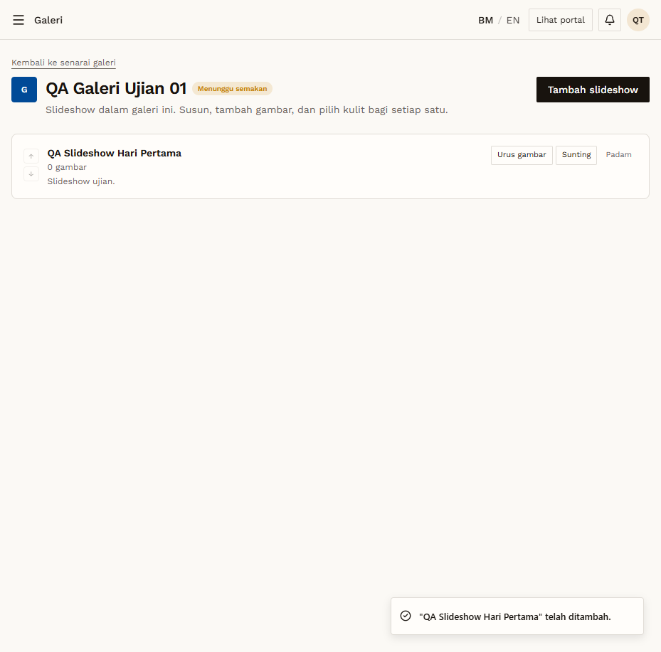

# GAL-03 — Add a slideshow (with required title)

- **Module:** Galeri (Galeri user, Admin)
- **Target:** https://martp.nizamjensani.digital/ · dashboard `/dashboard/galleries` · public `/resources/galleries`
- **Date:** 2026-09-25 · **Tool:** playwright-cli (headed)
- **Priority:** P0
- **Status:** **PASS**

## Preconditions
On the edit page of the new galeri.

## Steps
1. Tambah slideshow; Simpan with Tajuk empty.
2. Fill `QA Slideshow Hari Pertama`, Keterangan; save.

## Expected result
Empty title blocked; slideshow saved with '0 gambar'.

## Actual result
Empty title blocked by native tooltip. Saved; toast '… telah ditambah.'; the row shows title, '0 gambar', description and buttons ↑ ↓, Urus gambar, Sunting, Padam.

## Evidence
 
