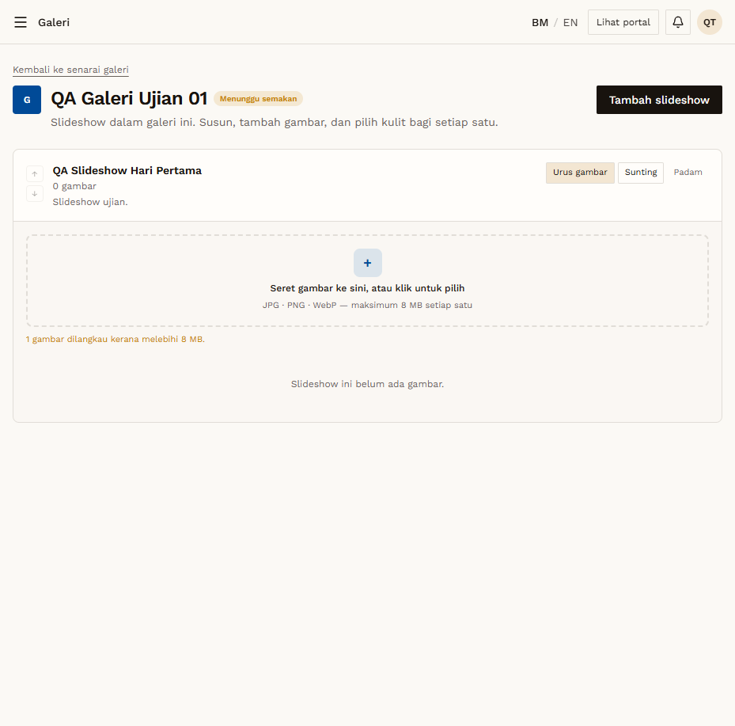

# GAL-04 — Image upload — wrong type and over 8 MB

- **Module:** Galeri (Galeri user, Admin)
- **Target:** https://martp.nizamjensani.digital/ · dashboard `/dashboard/galleries` · public `/resources/galleries`
- **Date:** 2026-09-25 · **Tool:** playwright-cli (headed)
- **Priority:** P1
- **Status:** **PASS**

## Preconditions
Urus gambar open. `fake.txt`; 9 MB JPG-headed file (limit is 8 MB each).

## Steps
1. Choose `fake.txt`.
2. Choose the 9 MB file.

## Expected result
Skipped with a message; nothing staged.

## Actual result
'1 fail dilangkau kerana bukan gambar.' and '1 gambar dilangkau kerana melebihi 8 MB.' are shown; the upload button never appears.

## Evidence

