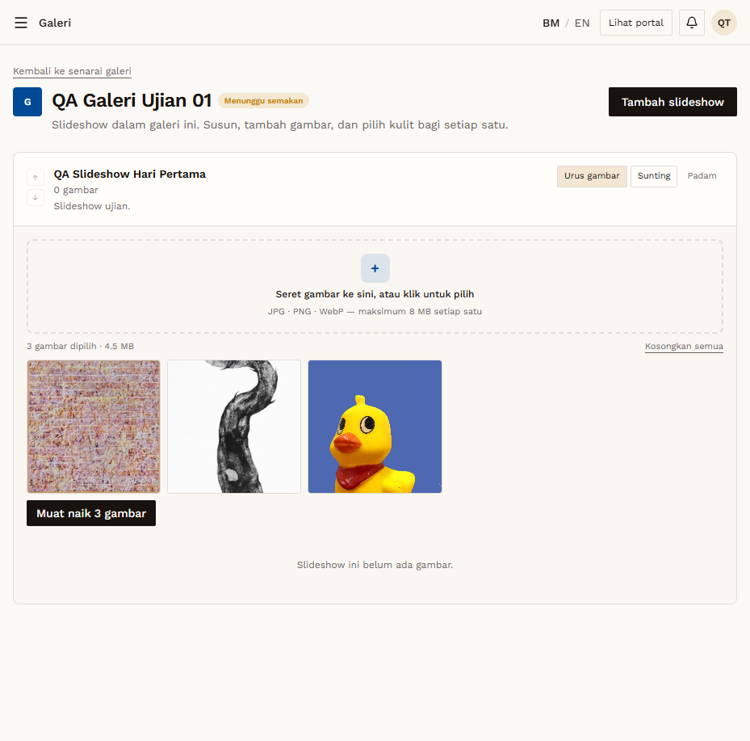
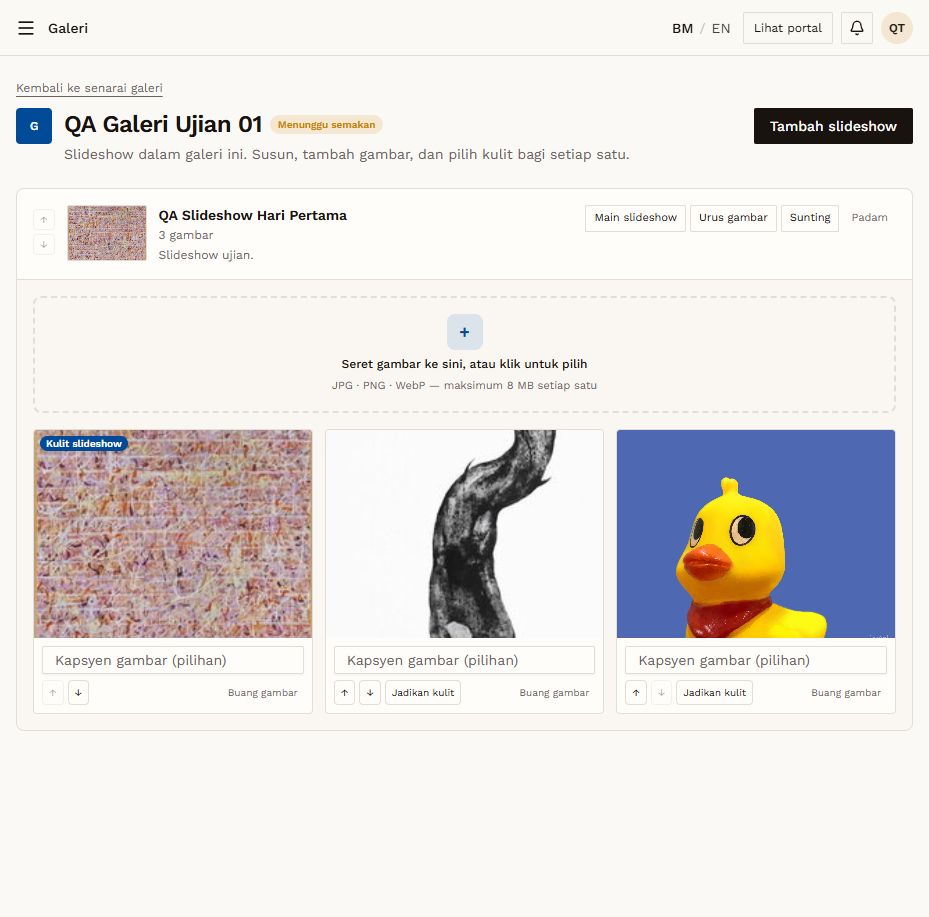

# GAL-05 — Upload several images at once

- **Module:** Galeri (Galeri user, Admin)
- **Target:** https://martp.nizamjensani.digital/ · dashboard `/dashboard/galleries` · public `/resources/galleries`
- **Date:** 2026-09-25 · **Tool:** playwright-cli (headed)
- **Priority:** P0
- **Status:** **PASS**

## Preconditions
Urus gambar open. Two small JPGs and `still_life_itik.jpg` (4.7 MB, valid under the 8 MB limit).

## Steps
1. Select all three files.
2. Check the staged summary; click 'Muat naik 3 gambar'.

## Expected result
All three uploaded; first becomes the cover.

## Actual result
Summary '3 gambar dipilih · 4.5 MB' with 'Kosongkan semua' and 'Muat naik 3 gambar'. After uploading the row shows '3 gambar' and the first image carries the badge 'Kulit slideshow'.

## Evidence
 
