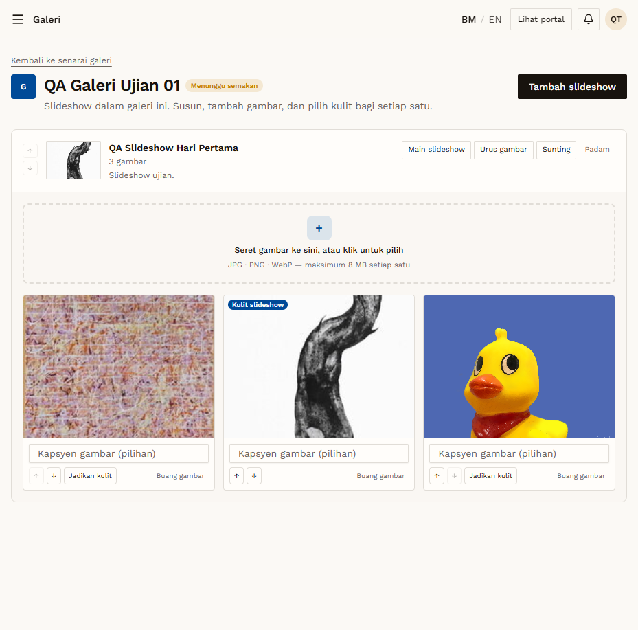
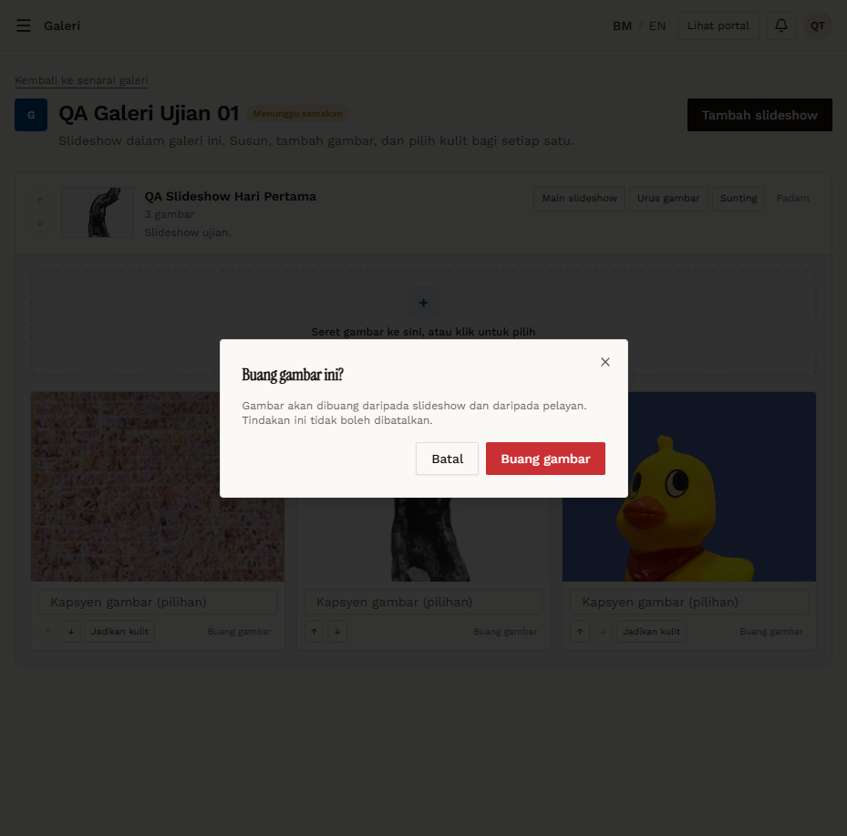

# GAL-06 — Set cover, reorder, caption, remove image

- **Module:** Galeri (Galeri user, Admin)
- **Target:** https://martp.nizamjensani.digital/ · dashboard `/dashboard/galleries` · public `/resources/galleries`
- **Date:** 2026-09-25 · **Tool:** playwright-cli (headed)
- **Priority:** P0
- **Status:** **PASS**

## Preconditions
Slideshow with 3 images.

## Steps
1. 'Jadikan kulit' on another image.
2. Reorder with ↓.
3. Type a caption and blur; reload.
4. Buang gambar → confirm.

## Expected result
Each action works and persists.

## Actual result
Cover changed (toast 'Kulit slideshow telah ditukar.', one badge). Order change persisted after reload. Caption saved (toast 'Kapsyen telah dikemas kini.') and was still present after reload. Buang gambar: dialog 'Gambar akan dibuang daripada slideshow dan daripada pelayan. Tindakan ini tidak boleh dibatalkan.'; after confirming the count went 3→2.

## Evidence
 
