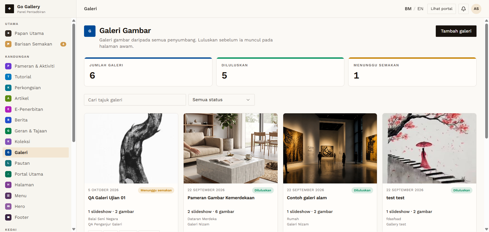
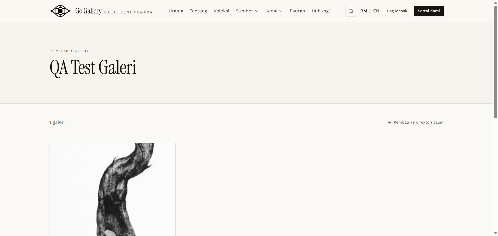
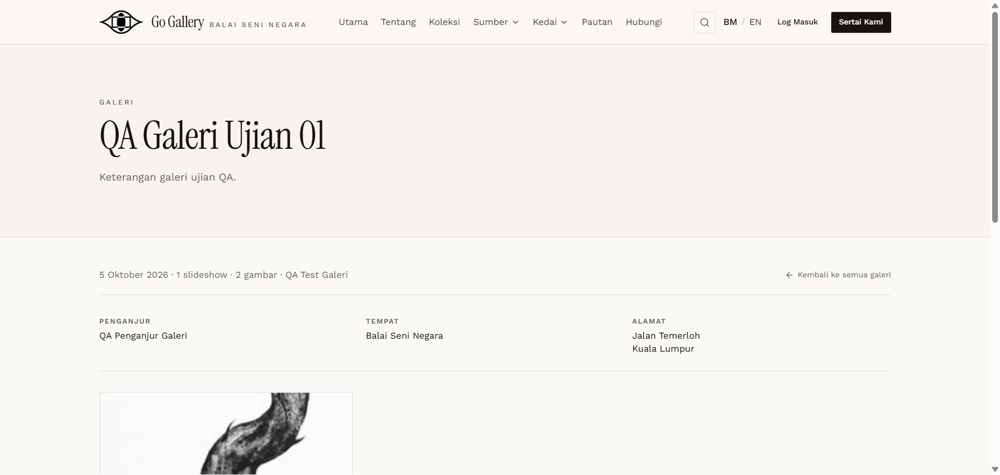
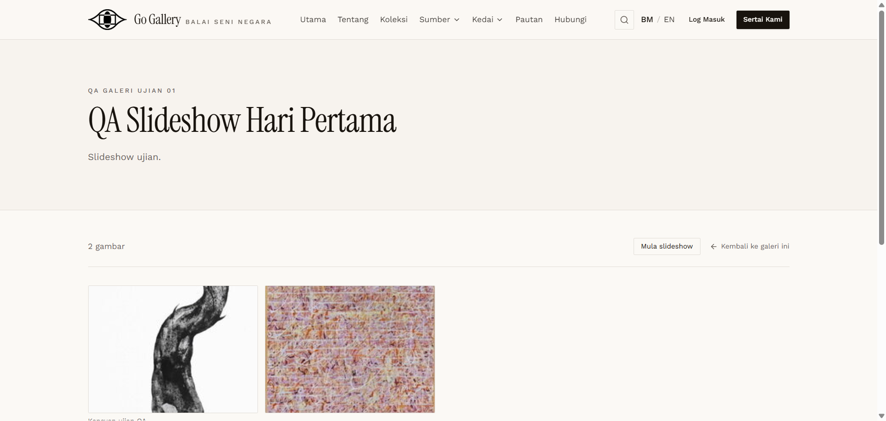
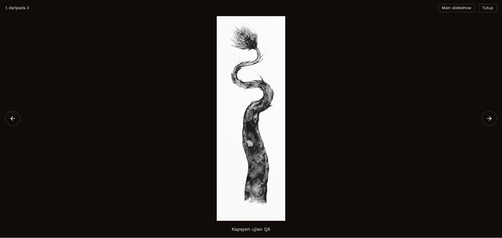

# GAL-08 — Admin approves → public directory, detail, slideshow, lightbox

- **Module:** Galeri (Galeri user, Admin)
- **Target:** https://martp.nizamjensani.digital/ · dashboard `/dashboard/galleries` · public `/resources/galleries`
- **Date:** 2026-09-25 · **Tool:** playwright-cli (headed)
- **Priority:** P0
- **Status:** **PASS**

## Preconditions
Admin (login-page quick-login 'Ahmad Safwan').

## Steps
1. Open `/dashboard/galleries` (admin sees all sources: 6 galeri); Luluskan the QA item.
2. Open owner profile, galeri detail and slideshow pages.
3. Open an image; use next; close.

## Expected result
Public pages show the galeri; the lightbox works.

## Actual result
Toast 'kini Diluluskan.'; only my item was pending. Directory lists owner `QA Test Galeri` (`/resources/galleries/815-qa-test-galeri`) with '1 galeri'; detail `/…/qa-galeri-ujian-01` shows date, organiser, venue, address (line break kept) and slideshow; slideshow page shows '2 gambar', 'Mula slideshow', caption. Lightbox: '1 daripada 2', buttons Main slideshow / Tutup / Gambar sebelumnya / Gambar seterusnya; next goes to '2 daripada 2'; Escape closes.

## Evidence
    
