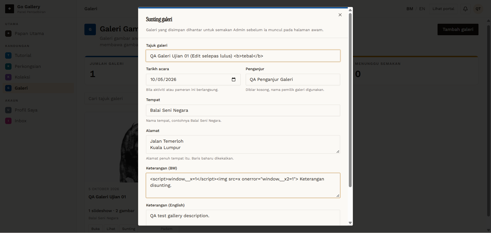

# GAL-09 — Owner edits an approved galeri

- **Module:** Galeri (Galeri user, Admin)
- **Target:** https://martp.nizamjensani.digital/ · dashboard `/dashboard/galleries` · public `/resources/galleries`
- **Date:** 2026-09-25 · **Tool:** playwright-cli (headed)
- **Priority:** P0
- **Status:** **FAIL (if re-review required) — needs product decision**

## Preconditions
Approved galeri; owner logged in.

## Steps
1. Sunting; check pre-filled values.
2. Change title to '… (Edit selepas lulus)'; save.
3. Check dashboard status and public page.

## Expected result
Returns to review, or the change waits for approval.

## Actual result
Fields pre-filled correctly. After saving the galeri stays **Diluluskan** and the new title is public immediately (slug unchanged). Same defect as Tutorial, Perkongsian and Koleksi. **Needs product decision.**

## Evidence

## Retest 2026-10-01
**PASS (fixed)**. See [RT-GAL-09](../retest-2026-10-01/RT-GAL-09.md).
