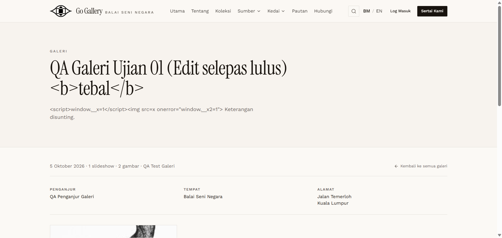

# GAL-10 — HTML / script injection in title and description

- **Module:** Galeri (Galeri user, Admin)
- **Target:** https://martp.nizamjensani.digital/ · dashboard `/dashboard/galleries` · public `/resources/galleries`
- **Date:** 2026-09-25 · **Tool:** playwright-cli (headed)
- **Priority:** P0
- **Status:** **PASS**

## Preconditions
Edit form open.

## Steps
1. Title `… <b>tebal</b>`.
2. Keterangan (BM) ``.
3. Save; open public detail.

## Expected result
Escaped; nothing executes.

## Actual result
Title and description are printed as literal text on the public page. No `<script>` or `onerror` elements exist; `window.__x*` undefined; no dialog. The list view and delete dialog also show the literal `<b>`.

## Evidence

