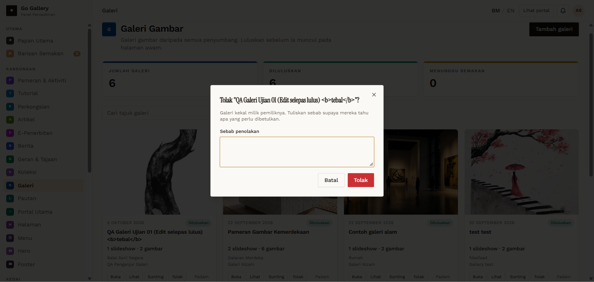
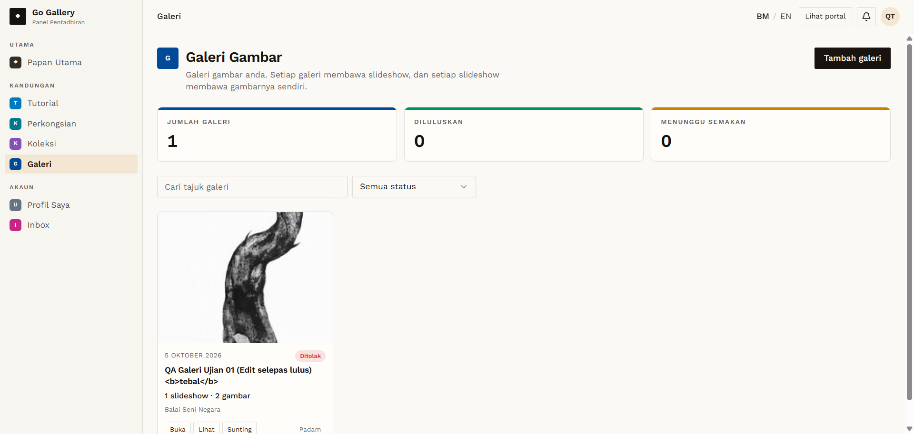
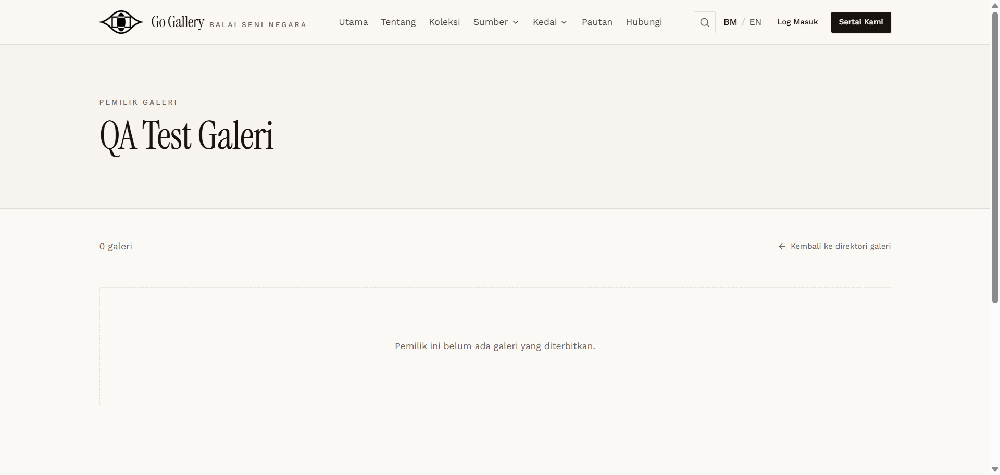

# GAL-11 — Admin rejects with a reason dialog, then re-approves

- **Module:** Galeri (Galeri user, Admin)
- **Target:** https://martp.nizamjensani.digital/ · dashboard `/dashboard/galleries` · public `/resources/galleries`
- **Date:** 2026-09-25 · **Tool:** playwright-cli (headed)
- **Priority:** P0
- **Status:** **PASS (observation: reason not shown to owner)**

## Preconditions
Approved galeri; admin logged in.

## Steps
1. Tolak → dialog 'Sebab penolakan'; submit with the reason empty (reason is not required).
2. Repeat with a reason 'Gambar kurang jelas…'.
3. Check public URLs; log in as the owner and look for the reason.
4. Luluskan again.

## Expected result
Galeri hidden; reason visible to owner; approval restores it.

## Actual result
The dialog says 'Tuliskan sebab supaya mereka tahu apa yang perlu dibetulkan.' Rejected: detail and slideshow URLs 404, owner profile shows '0 galeri'; re-approve → detail 200. The owner's list shows 'Ditolak' but **the reason is not shown** anywhere I looked (list card, Lihat preview, edit page, notifications: 'Tiada notifikasi').

## Evidence
  
