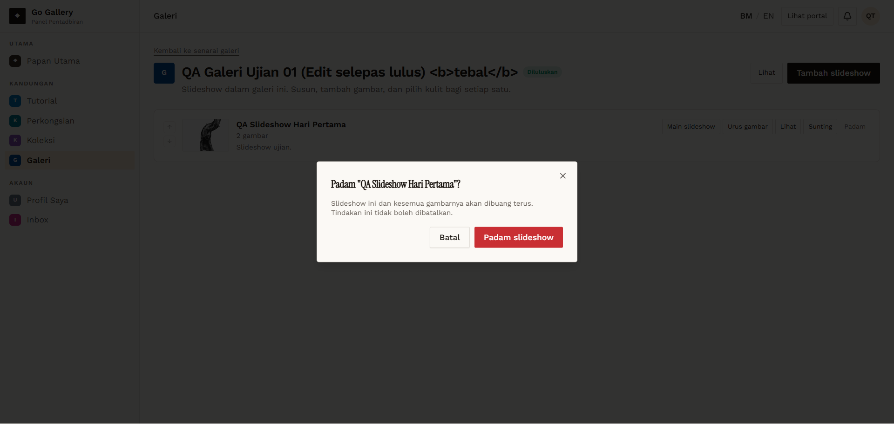
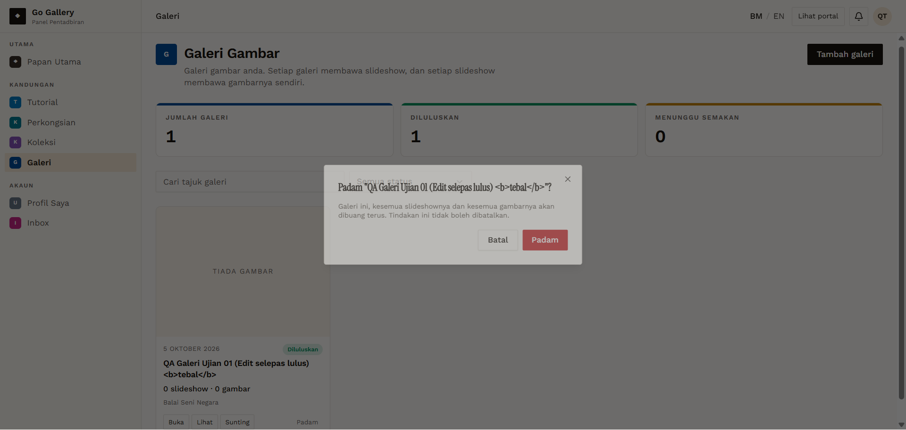

# GAL-12 — Delete slideshow and galeri (with Batal)

- **Module:** Galeri (Galeri user, Admin)
- **Target:** https://martp.nizamjensani.digital/ · dashboard `/dashboard/galleries` · public `/resources/galleries`
- **Date:** 2026-09-25 · **Tool:** playwright-cli (headed)
- **Priority:** P0
- **Status:** **PASS (observation: CDN keeps deleted image)**

## Preconditions
Owner logged in; approved galeri with 1 slideshow.

## Steps
1. Slideshow Padam → Batal, then 'Padam slideshow'.
2. Galeri Padam → Batal, then Padam.
3. Check public URLs and the image file URL.

## Expected result
Removed everywhere including files.

## Actual result
Dialogs: 'Slideshow ini dan kesemua gambarnya akan dibuang terus.' and 'Galeri ini, kesemua slideshownya dan kesemua gambarnya akan dibuang terus.' Batal keeps items. After confirming: count 0, slideshow and galeri URLs 404, owner profile '0 galeri'. Observation: an image URL still returned 200 (CDN cache, `max-age` 30 days) while the same URL with a cache-busting query returned 404, as with E-Penerbitan.

## Evidence
 
