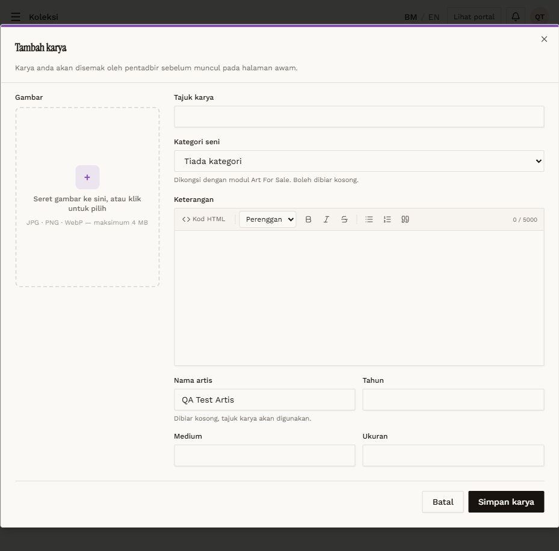

# KOL-01 — Create — required title (Artist)

- **Module:** Koleksi (Admin, Artist, Galeri)
- **Target:** https://martp.nizamjensani.digital/ · dashboard `/dashboard/collection` · public `/collection`, `/resources/artists-art`, `/resources/nag-collection`
- **Date:** 2026-09-25 · **Tool:** playwright-cli (headed)
- **Priority:** P1
- **Status:** **PASS (cosmetic)**

## Preconditions
Artist QA logged in, `/dashboard/collection`.

## Steps
1. Tambah karya.
2. Simpan karya with Tajuk karya empty.

## Expected result
Blocked.

## Actual result
Modal stays open; native tooltip 'Please fill in this field.' (English on Malay UI).

## Evidence

