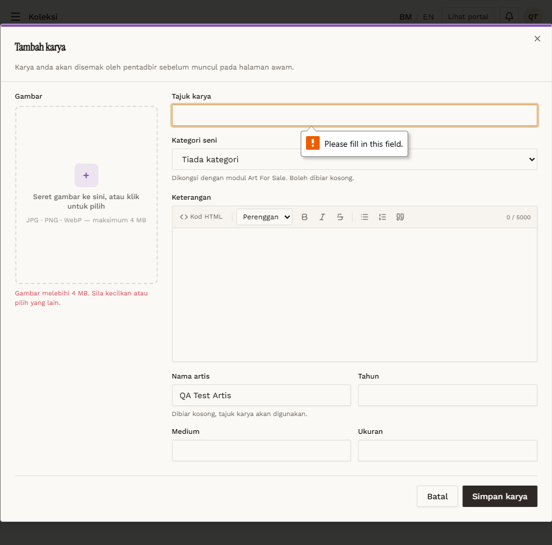

# KOL-02 — Image — wrong type and over 4 MB

- **Module:** Koleksi (Admin, Artist, Galeri)
- **Target:** https://martp.nizamjensani.digital/ · dashboard `/dashboard/collection` · public `/collection`, `/resources/artists-art`, `/resources/nag-collection`
- **Date:** 2026-09-25 · **Tool:** playwright-cli (headed)
- **Priority:** P1
- **Status:** **PASS**

## Preconditions
Create form open. `fake.txt`; `still_life_itik.jpg` (4.7 MB from `images/`).

## Steps
1. Choose `fake.txt`.
2. Choose the 4.7 MB JPG.

## Expected result
Both rejected.

## Actual result
'Hanya fail JPG, PNG atau WebP diterima.' and 'Gambar melebihi 4 MB.' shown inline (client-side). Nama artis is pre-filled with the account name (`QA Test Artis`). Kategori seni offers only 'Tiada kategori' and 'realisme' (lower-case).

## Evidence

