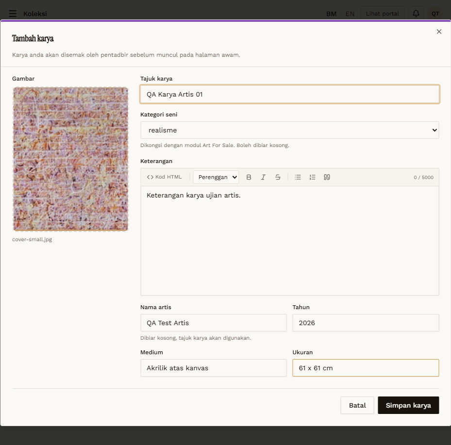
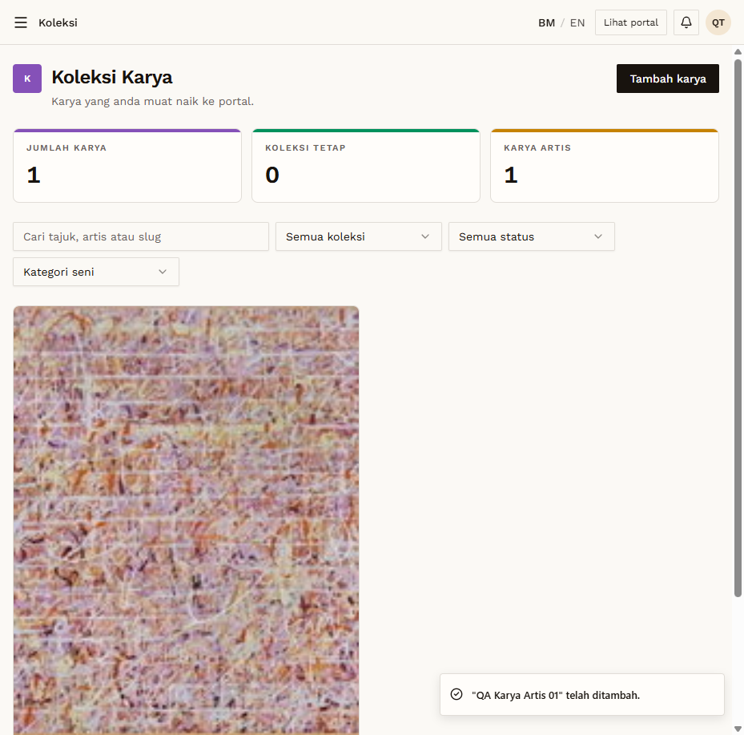

# KOL-03 — Artist creates a karya → pending

- **Module:** Koleksi (Admin, Artist, Galeri)
- **Target:** https://martp.nizamjensani.digital/ · dashboard `/dashboard/collection` · public `/collection`, `/resources/artists-art`, `/resources/nag-collection`
- **Date:** 2026-09-25 · **Tool:** playwright-cli (headed)
- **Priority:** P0
- **Status:** **PASS**

## Preconditions
Artist QA account. Image `7-_One_step_at_a_time…jpg`.

## Steps
1. Fill Tajuk `QA Karya Artis 01`, Kategori seni `realisme`, Keterangan, Tahun 2026, Medium, Ukuran.
2. Simpan karya.

## Expected result
Saved as 'Menunggu semakan'; form says admin reviews before it is public.

## Actual result
Toast '… telah ditambah.'; counters JUMLAH 1, KARYA ARTIS 1; card 'KARYA ARTIS · Menunggu semakan'. The artist list shows only their own work (0 items before).

## Evidence
 
