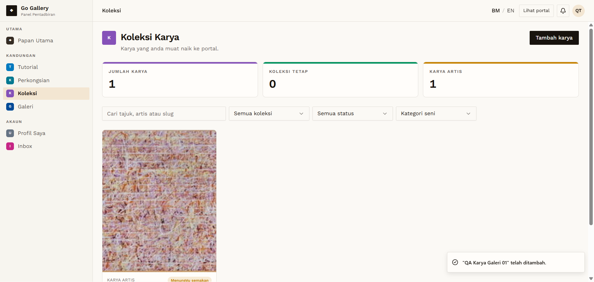

# KOL-04 — Galeri creates a karya → pending, own items only

- **Module:** Koleksi (Admin, Artist, Galeri)
- **Target:** https://martp.nizamjensani.digital/ · dashboard `/dashboard/collection` · public `/collection`, `/resources/artists-art`, `/resources/nag-collection`
- **Date:** 2026-09-25 · **Tool:** playwright-cli (headed)
- **Priority:** P0
- **Status:** **PASS**

## Preconditions
Galeri QA account.

## Steps
1. Open Koleksi; open Tambah karya (note Nama artis default).
2. Fill `QA Karya Galeri 01`, Nama artis `Artis Jemputan QA` (a gallery can credit another artist), year, medium, size, description.
3. Simpan.

## Expected result
Saved as pending; the gallery sees only its own items.

## Actual result
List showed 0 before and 1 after (the artist's item was not visible). Nama artis default `QA Test Galeri`. Saved as 'KARYA ARTIS · Menunggu semakan'.

## Evidence

