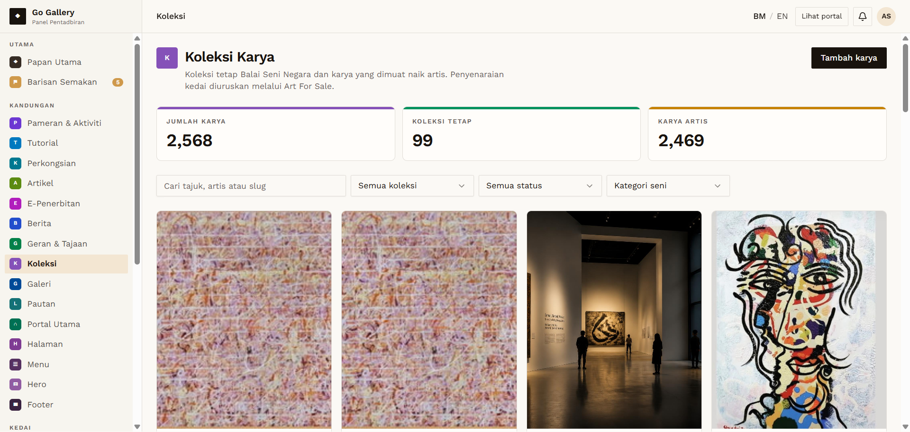
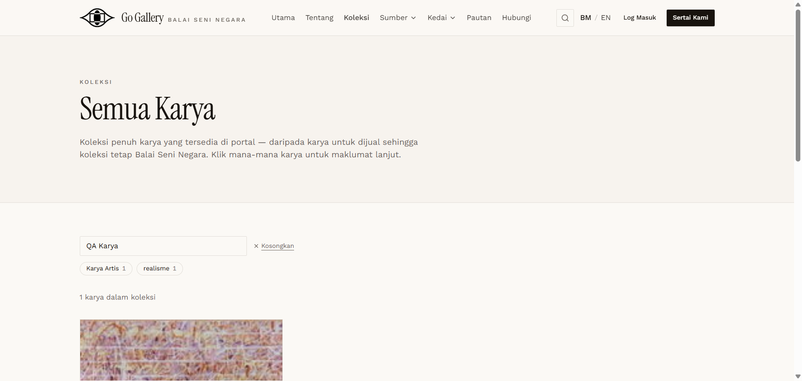
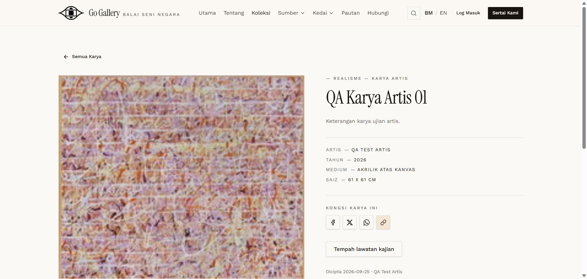

# KOL-06 — Admin reviews and approves → public

- **Module:** Koleksi (Admin, Artist, Galeri)
- **Target:** https://martp.nizamjensani.digital/ · dashboard `/dashboard/collection` · public `/collection`, `/resources/artists-art`, `/resources/nag-collection`
- **Date:** 2026-09-25 · **Tool:** playwright-cli (headed)
- **Priority:** P0
- **Status:** **PASS**

## Preconditions
Admin logged in (login-page quick-login 'Ahmad Safwan').

## Steps
1. Open `/dashboard/collection` (admin sees everyone's works: 2,568 total).
2. Luluskan the Artist item.
3. Search public pages and open the detail page.

## Expected result
Approved and public in the right listings.

## Actual result
Both QA items appear with 'Menunggu semakan' and Lihat/Sunting/Luluskan/Tolak/Padam. After approval: toast 'kini Diluluskan.'; listed on `/resources/artists-art` and `/collection`, not on `/resources/nag-collection`. Detail `/collection/qa-karya-artis-01` shows category, title, description, artist, year, medium, size and the image.

## Evidence
  
