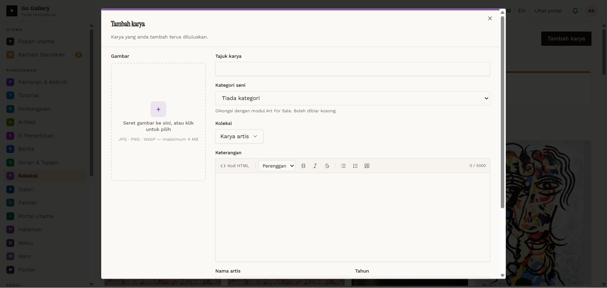
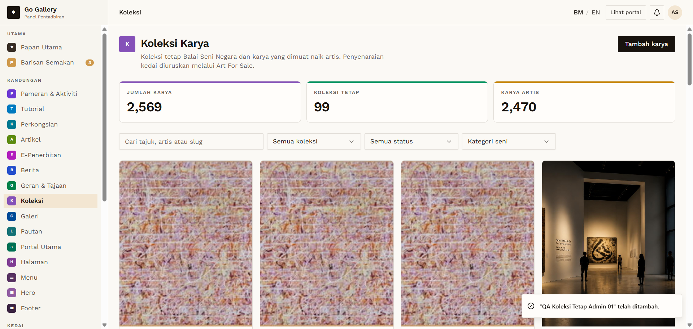
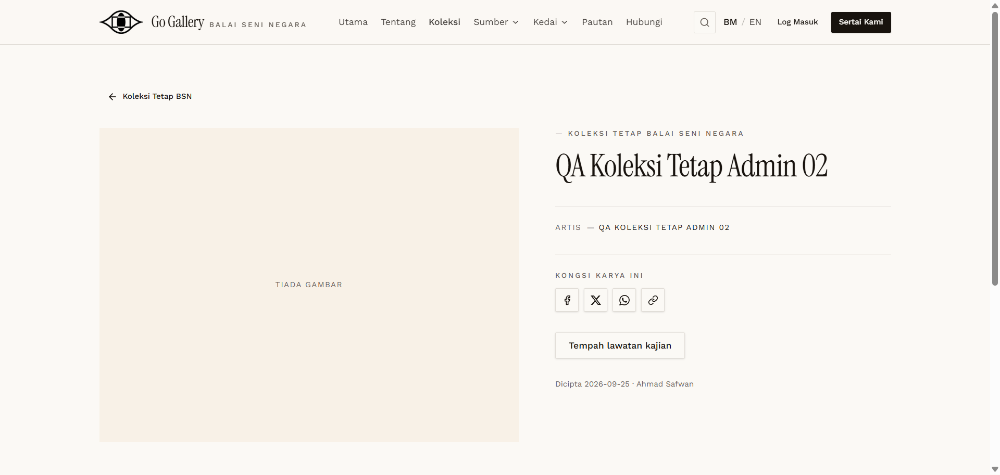

# KOL-08 — Admin creates works directly (auto-approved, Koleksi Tetap)

- **Module:** Koleksi (Admin, Artist, Galeri)
- **Target:** https://martp.nizamjensani.digital/ · dashboard `/dashboard/collection` · public `/collection`, `/resources/artists-art`, `/resources/nag-collection`
- **Date:** 2026-09-25 · **Tool:** playwright-cli (headed)
- **Priority:** P0
- **Status:** **PASS**

## Preconditions
Admin logged in.

## Steps
1. Tambah karya; note the extra 'Koleksi' selector (Koleksi Tetap Balai Seni Negara / Karya artis, default Karya artis).
2. Create `QA Koleksi Tetap Admin 01` (default type) and `QA Koleksi Tetap Admin 02` with 'Koleksi Tetap Balai Seni Negara' chosen.
3. Check public pages and counters.

## Expected result
Admin items approved directly; type honoured.

## Actual result
Both saved as Diluluskan. Admin 01 (default) → 'KARYA ARTIS'. Admin 02 → counter KOLEKSI TETAP 99→100, listed on `/resources/nag-collection` and `/collection`; detail `/collection/qa-koleksi-tetap-admin-02?from=nag-collection` shows 'Koleksi Tetap BSN'. The Koleksi selector appears only for admin.

## Evidence
  
