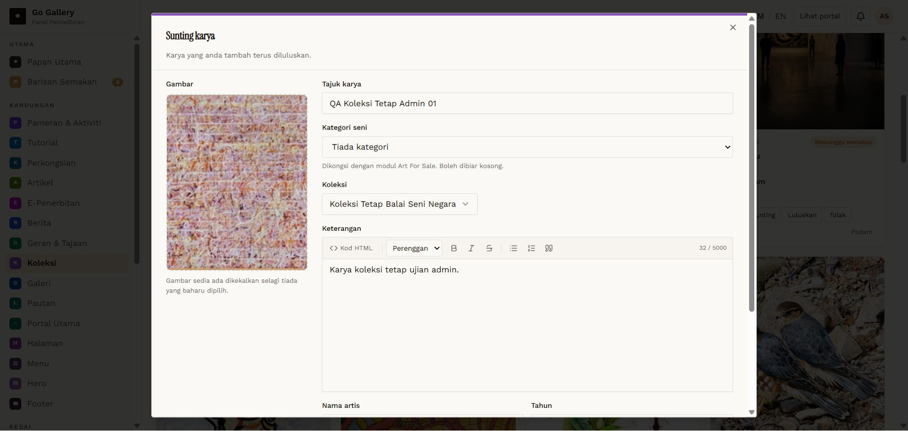
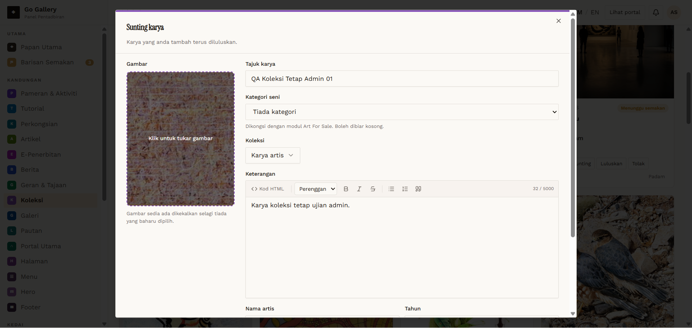

# KOL-09 — Admin changes an item's Koleksi type on edit

- **Module:** Koleksi (Admin, Artist, Galeri)
- **Target:** https://martp.nizamjensani.digital/ · dashboard `/dashboard/collection` · public `/collection`, `/resources/artists-art`, `/resources/nag-collection`
- **Date:** 2026-09-25 · **Tool:** playwright-cli (headed)
- **Priority:** P0
- **Status:** **FAIL**

## Preconditions
Approved item `QA Koleksi Tetap Admin 01` (Karya artis).

## Steps
1. Sunting; choose 'Koleksi Tetap Balai Seni Negara' in Koleksi.
2. Simpan; reload the dashboard and open Sunting again.
3. Repeat once to rule out a script error.

## Expected result
The item moves to Koleksi Tetap (counter +1, appears on `/resources/nag-collection`).

## Actual result
Toast 'telah dikemas kini' but the type **did not change** — the item stays 'KARYA ARTIS' (counter stays 99, public nag-collection 0). Reproduced twice; the same choice at creation works (KOL-08). **Defect: Koleksi type cannot be changed after creation.**

## Evidence
 
