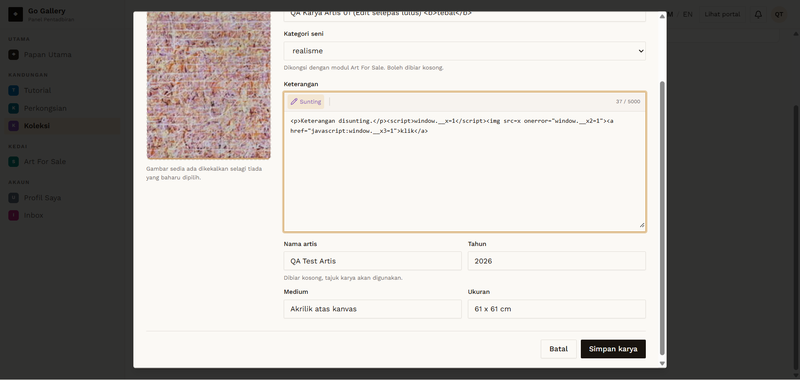

# KOL-10 — Artist/Galeri edits an approved karya

- **Module:** Koleksi (Admin, Artist, Galeri)
- **Target:** https://martp.nizamjensani.digital/ · dashboard `/dashboard/collection` · public `/collection`, `/resources/artists-art`, `/resources/nag-collection`
- **Date:** 2026-09-25 · **Tool:** playwright-cli (headed)
- **Priority:** P0
- **Status:** **FAIL (if re-review required) — needs product decision**

## Preconditions
Approved karya owned by the user.

## Steps
1. Artist: Sunting `QA Karya Artis 01`, change title to '… (Edit selepas lulus)', save.
2. Galeri: same on `QA Karya Galeri 01`.
3. Check dashboard and public page.

## Expected result
Item returns to review, or the change waits for approval.

## Actual result
Both stay **Diluluskan** and the new title is public immediately, with no re-review. Same defect as Tutorial (TUT-08) and Perkongsian (SHR-09). **Needs product decision.**

## Evidence

## Retest 2026-10-01
**PASS (fixed)**. See [RT-KOL-10](../retest-2026-10-01/RT-KOL-10.md).
